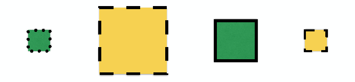

---

title       : Machine Learning
subtitle    : Programa de Estadística  
author      : Kevin Pérez - Ing de Sistemas - Estadístico - (E) MSc. Ciencia de Datos  
job         : Departamento de Matemáticas y Estadística - Universidad de Córdoba
logo        : unicordoba3.png
framework   : io2012        # {io2012, html5slides, shower, dzslides, ...}
highlighter : highlight.js  # {highlight.js, prettify, highlight}
hitheme     : tomorrow      # 
widgets     : [mathjax, bootstrap, quiz, shiny, interactive]            
mode        : selfcontained # {standalone, draft}
ext_widgets : {rCharts: [libraries/nvd3]}
knit        : slidify::knit2slides
---

## Contenido programático 

**Unidad de aprendizaje Nº 1.** Generalidades 

> - Conceptos Básicos del **_Machine Learning_**.
> - Diseño de un estudio de predicción. 
> - Importancia relativa. 
> - Error en y fuera de la muestra. 
> - Tipos de errores. 
> - Validación cruzada y tecnicas de remuestreo. 
> - Preprocesamiento de los datos. 
> - Medidas de calidad de los modelos 

---

## Contenido programático 

**Unidad de aprendizaje Nº 2.**  _Machine Learning Supervisado_

> - Modelos de regresión 
>   - Regresión lineal simple y multiple 

> - Modelos de clasificación 
>   - Análisis discriminante lineal 
>   - Regresión logistica 

> - Métodos basados en Árboles 
>   - Árboles de decisión
>   - Bagging
>   - Random Forest 
>   - Boosting

---

## Contenido programático 

**Unidad de aprendizaje Nº 3.**  _Machine Learning No Supervisado_

> - Métodos de reducción de dimensionalidad 
>   - ACP, ACM, DVS

> - Métodos Cluster 
>   - K-Means 
>   - Cluster Jerárquico  

> - Reglas de asociación 

---

## Contenido programático 

**Unidad de aprendizaje Nº 4.**  Otros métodos en _Machine Learning_

> - _Optimización: Algoritmos Geneticos_

> - _Support Vector Machines_

> - _Neural Networks_

> - _Pronosticos: Series de tiempo_

---

## Contenido programático 

**Unidad de aprendizaje Nº 5.**  Optimización de los modelos 

> - _Tunning_

> - _Regulización en regresión_

> - _Combinación de modelos_

> - _Predicción basada en modelos_

---

## Referencias 

- Trevor H, Robert T, Jerome F,  _The Elements of Statistical Learning_, 2ª Edición, Springer.

- Gareth J, Daniela W, Trevor H, Robert T, _An Introduction to Statistical Learning with Applications in R_, 6ª Edición, Springer. 

- Ethem A, _Introduction to Machine Learning_, 2ª Edición, The MIT Press
Cambridge, Massachusetts.

- Max Kuhn, et all., _The caret package_, R CRAN, disponible en http://topepo.github.io/caret/index.html. 

---

## Motivación 

- Reconocido a nivel mundial en la academia

    - [Phd. in Machine Learning University of Alberta](https://www.ualberta.ca/computing-science/graduate-studies/programs-and-admissions/statistical-machine-learning)
    - [Phd. in Machine Learning Carnegie Mellon University](http://www.ml.cmu.edu/prospective-students/ml-phd.html)

- Alta demanda laboral 

    - [Statistical Jobs](http://hagutierrezro.blogspot.com.co/p/jobs.html)
    - [Data Scientist](https://hbr.org/2012/10/data-scientist-the-sexiest-job-of-the-21st-century)
    
- Un deporte moderno 

    - [Competencias](https://www.kaggle.com/competitions)
    - [Premios](http://www.netflixprize.com)


---


## Que es _Machine Learning_


> - Construcción/uso de algoritmos que _**aprenden**_ de los datos 

> - Más información implica mejor _**desempeño**_

> - Soluciones previas implican _**Experiencia**_ 

---


## Ejemplo 

- Etiquetar un cuadrado: Tamaño y borde  ---- Color 

- Previas observaciones (Etiquetadas por personas): 

<center></center>

- Tarea de la maquina: _**Etiquetar**_ un nuevo cuadrado 

- Resultado: Éxito o Fracaso! 

---

## Formulación 


<center></center>


---

## Que no es _Machine Learning_

- _**No**_ es machine learning 

    - Determinar el color que se presenta con mayor frecuencia 
    - Calcular el tamaño promedio del cuadrado 
    
- _**La Meta principal**_: Construir modelos para la predicción  

---

## Un problema de  Regresión 

<center></center>

---

## Predicción 

<center></center>

---

## _Statistical Learning_

El _Statistical Learning_ se refiere al vasto conjunto de herramientas para la _comprensión de los datos_. Estas herramientas pueden ser clasificadas _supervisadas_ o _no supervisadas_.

> - _supervised statistical learning:_ Implica la construcción de un modelo estadístico para predecir, o estimar, una _salida_ basada en una o más _entradas_.

> - _unsupervised statistical learning:_ Con estos modelos, existen _entradas_ pero no existen salidas supervisadas, sin embargo se puede aprender de la estructura de los datos.

---

## Por que estimar $f$

Existen dos razones principales por las cuales quisiéramos estimar $f$: _**Predicción**_ e _**Inferencia**_, teniendo en cuenta que: 

$$\mathbf{Y}= f(\mathbf{Y})+ \epsilon$$

Asumiendo las restricciones de cada modelo y teniendo en cuenta la naturaleza de cada unas las variables involucradas en el mismo.

---

## Predicción 

En muchas situaciones, un conjunto de _entradas_ $X$ se encuentran disponibles, pero la salida $Y$ no puede ser obtenida fácilmente. En esta situación y asumiendo que el termino de error es cero, podemos predecir $Y$ utilizando 

$$\hat{Y}=\hat{f}(X),$$
Donde $\hat{f}$ representa nuestra estimación para $f$ y $\hat{Y}$ representa la predicción resultante para $Y$. 

---

## Predicción 

Bajo estas condiciones $\hat{f}$ a menudo es considerada una _**caja negra**_ y en este sentido no se tiene en cuenta o nos interesa la forma de la función $\hat{f}$ siempre que de ella resulten buenas predicciones. 

<center></center>


---

## Inferencia 

En este caso a menudo el interés se centra no solo en una buena predicción, también en la forma en que $Y$ se ve afectada por los cambios en $X_1, \ldots, X_p$. En otras palabras estamos interesados en la relación que guarden $X$ y $Y$ o en los cambios de $Y$ como función de $X_1, \ldots, X_p$. En este sentido es lógico tratar de responder las siguientes preguntas

> - ¿Qué predictores están asociados con la respuesta?
> - ¿Cuál es la relación entre la respuesta y cada predictor?
> - ¿Se puede resumir adecuadamente la relación entre $Y$ y cada predictor, 
usando una ecuación lineal, o es la relación más complicada?


---

## Como estimamos $f$

Hablando de una manera muy general y teniendo en cuenta que queremos encontrar una función $\hat{f}$ tal que $Y\approx \hat{f}(X)$ para cada observación $(X, Y)$, los métodos estadísticos para esta tarea pueden ser clasificados como: 

- Métodos Paramétricos 
- Métodos No Paramétricos 


---

## Métodos Paramétricos 

Los métodos paramétricos involucran un enfoque de dos pasos para el planteamiento del modelo

1. Se asumen unos supuestos acerca de la forma funcional de $f$, por ejemplo, un supuesto muy simple es que $f$ es lineal en $X$:

$$f(X)= \beta_0+\beta_1X_1+\beta_2X_2+\cdots +\beta_pX_p$$
2. Una vez el modelo fue seleccionado, necesitamos un procedimiento de ajuste. En el caso del modelo lineal necesitamos estimar los parámetros $\beta_0, \beta_1, \ldots, \beta_p$, esto es, encontrar los valores de esos parámetros tal que 

$$Y\approx \beta_0+\beta_1X_1+\beta_2X_2+\cdots +\beta_pX_p$$

---

## Métodos Paramétricos

<center></center>

---

## Métodos No Paramétricos 

Los métodos no paramétricos hacen o lanzan supuestos explícitos acerca de la forma funcional de $f$, en lugar de eso buscan una estimación de $f$ que se aproxima a los puntos de los datos como sea posible sin ser demasiado áspera o sinuosa (ondulada).

<center></center>

---

## Compensación entre flexibilidad e interpretabilidad 

Los métodos estadísticos del _machine learning_ propuestos anteriormente algunos son menos flexibles o menos restrictivos, en el sentido de que pueden producir sólo una gama relativamente pequeña de formas para estimar $f$, otros métodos como el _thin plate splines_ son mucho más flexibles porque pueden generar una gama mucho más amplia de formas posibles para estimar $f$. 

<center></center>

---

## Componentes de un predictor


<br>

<center> pregunta -> data de entrada -> características -></center>

<center> algoritmos -> parámetros -> evaluación </center>

---

## Ejemplo SPAM 

</br>

<center> `pregunta` -> data de entrada -> características -></center>

<center> algoritmos -> parámetros -> evaluación </center>

</br>

__Comienza con una pregunta muy general__

Puedo detectar automáticamente los emails que son SPAM de los que no ?


__Más especifica__

Puedo utilizar características cuantitativas para clasificar los emails como SPAM/HAM

---

## Ejemplo SPAM 

</br>

<center> pregunta -> `data de entrada` -> características -></center>

<center> algoritmos -> parámetros -> evaluación </center>

</br>

Véase `help(spam)` en el paquete `kernlab`

---


## Ejemplo SPAM

</br>

<center> pregunta -> data de entrada -> `características` -></center>

<center> algoritmos -> parámetros -> evaluación </center>

</br>


<b>
Dear Jeff, 

Can you send me your address so I can send you the invitation? 

Thanks,

Ben
</b>

---

## Ejemplo SPAM 


</br>

<center> pregunta -> data de entrada -> `características` -></center>

<center> algoritmos -> parámetros -> evaluación </center>
</br>

<b> 

Dear Jeff, 

Can <rt>you</rt> send me your address so I can send <rt>you</rt> the invitation? 

Thanks,

Ben
</b>

</br>

Frecuencia de `you` $= 2/17 = 0.118$

---

## Ejemplo SPAM 

</br>

<center> pregunta -> data de entrada -> `características` -></center>

<center> algoritmos -> parámetros -> evaluación </center>
</br>


```{r, message=FALSE, warning=FALSE}
suppressMessages(suppressWarnings(library(kernlab))) 
data(spam)
head(spam, 3)[, 1:11]

```

---

## Ejemplo SPAM 

<center> pregunta -> data de entrada -> características -></center>

<center> `algoritmos` -> parámetros -> evaluación </center>


```{r, fig.height = 3, fig.width = 6, fig.align ='center'}
plot(density(spam$your[spam$type == "nonspam"]),
     col = "blue", main = "", xlab = "Frecuencia de 'your'", 
     frame.plot = F)
lines(density(spam$your[spam$type == "spam"]), col = "red")
```

---

## Ejemplo SPAM 

<center> pregunta -> data de entrada -> características -></center>

<center> `algoritmos` -> parámetros -> evaluación </center>

</br></br>

__Nuestro algoritmo__

* Encuentre un valor $C$. 
* __frecuencia de 'your' $>$ C__ prediga "spam"

---

## Ejemplo SPAM 

```{r, fig.height = 4, fig.width = 6, fig.align ='center'}
plot(density(spam$your[spam$type == "nonspam"]),
     col = "blue", main = "", xlab = "Frecuencia de 'your'", 
     frame.plot = F)
lines(density(spam$your[spam$type == "spam"]), col = "red")
abline(v = 0.5,col = "black")
```


---

## Ejemplo SPAM 


<center> pregunta -> data de entrada -> características -></center>

<center>algoritmos-> parámetros -> `evaluación` </center>

```{r, fig.height = 4, fig.width= 6, fig.align='center'}
prediction <- ifelse(spam$your > 0.5, "spam", "nonspam")
table(prediction,spam$type)/length(spam$type)
```
</br>
<center>
Precisión $ \approx 0.459 + 0.292 = 0.751$
</center>

---

## Orden de la importancia relativa 

<center> pregunta -> data de entrada -> características -> algoritmos <center/>

---

## Basura entra = Basura sale 

<center> pregunta -> `data de entrada` -> características -></center>

<center> algoritmos -> parámetros -> evaluación </center>

1. Puede ser fácil (movie películas -> nuevos ratings)
2. Puede ser difícil (data de genomas -> enfermedades)
3. Si se puede (más data -> mejores modelos)
4. Es el paso más importante ¡

---

## Características 

<center> pregunta -> data de entrada -> `características` -></center>

<center> algoritmos -> parámetros -> evaluación </center>

**Propiedades de las buenas características**

- llevar a la comprensión de los datos 
- conservar la información relevante
- son creadas con base a el conocimiento experto

**Errores comunes**

- Tratar de automatizar la selección de características 
- No prestar atención a las particularidades de los datos 
- Despreciar información innecesariamente 

---

## Temas a considerar 

<center></center>

---

## Compensación en predicción 

- Interpretabilidad vs Precisión 

- Velocidad vs Precisión 

- Simplicidad vs Precisión 

- Escalabilidad vs Precisión

---

## Error dentro vs Error fuera de la muestra 

_**In Sample Error**_: Es la tasa de error que se obtiene en el mismo conjunto de datos que utilizó para construir su predictor. A veces llamado error de resubstitución.

_**Out of Sample Error**_: La tasa de error que obtiene en un nuevo conjunto de datos. A veces llamado error de generalización.

_**Ideas principales**_

- _**Out of Sample Error**_ es lo que nos preocupa 

- El _**In Sample Error**_ $<$ _**Out of Sample Error**_

- La razón principal es el sobre ajuste 
    * Acomodar su algoritmo con los datos que tiene

---


## Error dentro vs Error fuera de la muestra 

```{r , fig.height = 4,fig.width = 6, fig.align='center'}
suppressMessages(suppressWarnings(library(kernlab)))
data(spam); set.seed(333)
smallSpam <- spam[sample(dim(spam)[1],size = 10),]
spamLabel <- (smallSpam$type == "spam")*1 + 1
plot(smallSpam$capitalAve,col = spamLabel, frame.plot = FALSE, pch = 19)

```

---

## Regla de predicción 1

* capitalAve $>$ 2.7 = "spam"
* capitalAve $<$ 2.40 = "nonspam"
* capitalAve entre 2.40 y 2.45 = "spam"
* capitalAve entre 2.45 y 2.7 = "nonspam"

---

## Aplicando la regla 1 a `smallSpam`

```{r}
rule1 <- function(x){
  prediction <- rep(NA,length(x))
  prediction[x > 2.7] <- "spam"
  prediction[x < 2.40] <- "nonspam"
  prediction[(x >= 2.40 & x <= 2.45)] <- "spam"
  prediction[(x > 2.45 & x <= 2.70)] <- "nonspam"
  return(prediction)
}
table(rule1(smallSpam$capitalAve),smallSpam$type)
```

---

## Regla de predicción 2

* capitalAve $>$ 2.40 = "spam"
* capitalAve $\leq$ 2.40 = "nonspam"


---

## Apliclando la Regla 2 a `smallSpam`


```{r}
rule2 <- function(x){
  prediction <- rep(NA,length(x))
  prediction[x > 2.8] <- "spam"
  prediction[x <= 2.8] <- "nonspam"
  return(prediction)
}
table(rule2(smallSpam$capitalAve),smallSpam$type)
```

---

## Aplicando a la data completa `spam`

```{r}
table(rule1(spam$capitalAve), spam$type)
table(rule2(spam$capitalAve), spam$type)

```

---

## Aplicando a la data completa `spam`

```{r}
mean(rule1(spam$capitalAve) == spam$type)
mean(rule2(spam$capitalAve) == spam$type)

```

---

## La precisión 

```{r, dependson="loadData"}
sum(rule1(spam$capitalAve) == spam$type)
sum(rule2(spam$capitalAve) == spam$type)
```


---

## Que sucede? 

<center>`Sobre ajuste`</center>

* La data tiene dos partes 
    * Patrones 
    * Ruido
* La meta de una predicción es encontrar patrones 
* Siempre se puede diseñar un predictor perfecto en la muestra
* Se capturan ambas patrones y ruidos cuando haces eso  
* El predictor no funcionará tan bien en nuevas muestras

---

## Diseño de un estudio de predicción 

1. Defina su tasa de error 
2. Divida la data en:
  * Preparación, Prueba, Validación (opcional)
3. En la data de preparación escoja las características (variables) 
  * Utilice `cross-validation`
4. En la data de preparación se escoja la función
  * Utilice `cross-validation`
6. Si no se hace validación 
  * Aplique 1x (Una vez) al conjunto de prueba
7. Si se hace validación
  * Aplique al conjunto de prueba y refine 
  * Aplique 1x (Una vez) al conjunto de validación 


---

## Diseño de un estudio de predicción 

<center></center>

---

## Reglas básicas para el diseño

* Si tiene un tamaño de muestra grande
    * 60% Preparación
    * 20% Prueba
    * 20% Validación
* Si tiene un tamaño de muestra medio 
    * 60% Preparación
    * 40% Prueba
* Si tiene un tamaño de muestra pequeño
    * Haga `cross validation`
    * Reporte la advertencia de tamaño de muestra pequeño 

---

## Terminos básicos 

En general, __Positivo__ = identificados y __negativo__ = rechazado. Por lo tanto:

__Verdadero positivo__ = identificado correctamente 

__Falso positivo__ = identificado incorrectamente 

__Verdadero negativo__ = rechazado correctamente 

__Falso negativo__ = rechazado incorrectamente 

_Ejemplo de un test Medico_:

__Verdadero positivo__ = Personas enfermas correctamente diagnosticadas como enfermas

__Falso positivo__= Personas sanas identificadas incorrectamente como enfermas

__Verdadero negativo__ = Gente sana correctamente identificada como saludable

__Falso negativo__ = Personas enfermas identificadas incorrectamente como saludables.

---

## Cantidades clave 

<center></center>

---

## Cantidades clave como fracciones 

<center></center>

---

## Para datos continuos 

- **Error cuadrático medio**

$$\frac{1}{n}\sum_{i=1}^n (prediccion_i-verdadero_i)^2$$

- **Raíz error cuadrático medio**

$$\sqrt{\frac{1}{n}\sum_{i=1}^n (prediccion_i-verdadero_i)^2}$$

---

## Medidas comunes de error

1. Error cuadrático medio
  * Datos continuos, sensible a los `outliers`
2. Desviación media absoluta 
  * Datos continuos, A menudo más robusta
3. Sensibilidad _Sensitivity_ 
  * Si desea perder algunos positivos
4. Especificidad _Specificity_
  * Si quieres algunos negativos llamados positivos
5. Precisión _Accuracy_
  * Pondera falsos positivos/negativos igualmente
6. Concordancia _Concordance_
  * Un ejemplo en [kappa](http://en.wikipedia.org/wiki/Cohen%27s_kappa)


