---

title       : Machine Learning
subtitle    : Programa de Estadística  
author      : Kevin Pérez - Ing de Sistemas - Estadístico - (E) MSc. Ciencia de Datos  
job         : Departamento de Matemáticas y Estadística - Universidad de Córdoba
logo        : unicordoba3.png
framework   : io2012        # {io2012, html5slides, shower, dzslides, ...}
highlighter : highlight.js  # {highlight.js, prettify, highlight}
hitheme     : tomorrow      # 
widgets     : [mathjax, bootstrap, quiz, shiny, interactive]            
mode        : selfcontained # {standalone, draft}
ext_widgets : {rCharts: [libraries/nvd3]}
knit        : slidify::knit2slides
---

## Contenido programático 

**Unidad de aprendizaje Nº 1.** Generalidades 

> - Conceptos Básicos del **_Machine Learning_**.
> - Diseño de un estudio de predicción. 
> - Importancia relativa. 
> - Error en y fuera de la muestra. 
> - Tipos de errores. 
> - Validación cruzada y tecnicas de remuestreo. 
> - Preprocesamiento de los datos. 
> - Medidas de calidad de los modelos 

---

## Contenido programático 

**Unidad de aprendizaje Nº 2.**  _Machine Learning Supervisado_

> - Modelos de regresión 
>   - Regresión lineal simple y multiple 

> - Modelos de clasificación 
>   - Análisis discriminante lineal 
>   - Regresión logistica 

> - Métodos basados en Árboles 
>   - Árboles de decisión
>   - Bagging
>   - Random Forest 
>   - Boosting

---

## Contenido programático 

**Unidad de aprendizaje Nº 3.**  _Machine Learning No Supervisado_

> - Métodos de reducción de dimensionalidad 
>   - ACP, ACM, DVS

> - Métodos Cluster 
>   - K-Means 
>   - Cluster Jerárquico  

> - Reglas de asociación 

---

## Contenido programático 

**Unidad de aprendizaje Nº 4.**  Otros métodos en _Machine Learning_

> - _Optimización: Algoritmos Geneticos_

> - _Support Vector Machines_

> - _Neural Networks_

> - _Pronosticos: Series de tiempo_

---

## Contenido programático 

**Unidad de aprendizaje Nº 5.**  Optimización de los modelos 

> - _Tunning_

> - _Regulización en regresión_

> - _Combinación de modelos_

> - _Predicción basada en modelos_

---

## Referencias 

- Trevor H, Robert T, Jerome F,  _The Elements of Statistical Learning_, 2ª Edición, Springer.

- Gareth J, Daniela W, Trevor H, Robert T, _An Introduction to Statistical Learning with Applications in R_, 6ª Edición, Springer. 

- Ethem A, _Introduction to Machine Learning_, 2ª Edición, The MIT Press
Cambridge, Massachusetts.

- Max Kuhn, et all., _The caret package_, R CRAN, disponible en http://topepo.github.io/caret/index.html. 

---

## Motivación 

- Reconocido a nivel mundial en la academia

    - [Phd. in Machine Learning University of Alberta](https://www.ualberta.ca/computing-science/graduate-studies/programs-and-admissions/statistical-machine-learning)
    - [Phd. in Machine Learning Carnegie Mellon University](http://www.ml.cmu.edu/prospective-students/ml-phd.html)

- Alta demanda laboral 

    - [Statistical Jobs](http://hagutierrezro.blogspot.com.co/p/jobs.html)
    - [Data Scientist](https://hbr.org/2012/10/data-scientist-the-sexiest-job-of-the-21st-century)
    
- Un deporte moderno 

    - [Competencias](https://www.kaggle.com/competitions)
    - [Premios](http://www.netflixprize.com)


---


## Que es _Machine Learning_


> - Construcción/uso de algoritmos que _**aprenden**_ de los datos 

> - Más información implica mejor _**desempeño**_

> - Soluciones previas implican _**Experiencia**_ 

---


## Ejemplo 

- Etiquetar un cuadrado: Tamaño y borde  ---- Color 

- Previas observaciones (Etiquetadas por personas): 

<center></center>

- Tarea de la maquina: _**Etiquetar**_ un nuevo cuadrado 

- Resultado: Éxito o Fracaso! 

---

## Formulación 


<center></center>


---

## Que no es _Machine Learning_

- _**No**_ es machine learning 

    - Determinar el color que se presenta con mayor frecuencia 
    - Calcular el tamaño promedio del cuadrado 
    
- _**La Meta principal**_: Construir modelos para la predicción  

---

## Un problema de  Regresión 

<center></center>

---

## Predicción 

<center></center>

---

## _Statistical Learning_

El _Statistical Learning_ se refiere al vasto conjunto de herramientas para la _comprensión de los datos_. Estas herramientas pueden ser clasificadas _supervisadas_ o _no supervisadas_.

> - _supervised statistical learning:_ Implica la construcción de un modelo estadístico para predecir, o estimar, una _salida_ basada en una o más _entradas_.

> - _unsupervised statistical learning:_ Con estos modelos, existen _entradas_ pero no existen salidas supervisadas, sin embargo se puede aprender de la estructura de los datos.

---

## Por que estimar $f$

Existen dos razones principales por las cuales quisiéramos estimar $f$: _**Predicción**_ e _**Inferencia**_, teniendo en cuenta que: 

$$\mathbf{Y}= f(\mathbf{Y})+ \epsilon$$

Asumiendo las restricciones de cada modelo y teniendo en cuenta la naturaleza de cada unas las variables involucradas en el mismo.

---

## Predicción 

En muchas situaciones, un conjunto de _entradas_ $X$ se encuentran disponibles, pero la salida $Y$ no puede ser obtenida fácilmente. En esta situación y asumiendo que el termino de error es cero, podemos predecir $Y$ utilizando 

$$\hat{Y}=\hat{f}(X),$$
Donde $\hat{f}$ representa nuestra estimación para $f$ y $\hat{Y}$ representa la predicción resultante para $Y$. 

---

## Predicción 

Bajo estas condiciones $\hat{f}$ a menudo es considerada una _**caja negra**_ y en este sentido no se tiene en cuenta o nos interesa la forma de la función $\hat{f}$ siempre que de ella resulten buenas predicciones. 

<center></center>


---

## Inferencia 

En este caso a menudo el interés se centra no solo en una buena predicción, también en la forma en que $Y$ se ve afectada por los cambios en $X_1, \ldots, X_p$. En otras palabras estamos interesados en la relación que guarden $X$ y $Y$ o en los cambios de $Y$ como función de $X_1, \ldots, X_p$. En este sentido es lógico tratar de responder las siguientes preguntas

> - ¿Qué predictores están asociados con la respuesta?
> - ¿Cuál es la relación entre la respuesta y cada predictor?
> - ¿Se puede resumir adecuadamente la relación entre $Y$ y cada predictor, 
usando una ecuación lineal, o es la relación más complicada?


---

## Como estimamos $f$

Hablando de una manera muy general y teniendo en cuenta que queremos encontrar una función $\hat{f}$ tal que $Y\approx \hat{f}(X)$ para cada observación $(X, Y)$, los métodos estadísticos para esta tarea pueden ser clasificados como: 

- Métodos Paramétricos 
- Métodos No Paramétricos 


---

## Métodos Paramétricos 

Los métodos paramétricos involucran un enfoque de dos pasos para el planteamiento del modelo

1. Se asumen unos supuestos acerca de la forma funcional de $f$, por ejemplo, un supuesto muy simple es que $f$ es lineal en $X$:

$$f(X)= \beta_0+\beta_1X_1+\beta_2X_2+\cdots +\beta_pX_p$$
2. Una vez el modelo fue seleccionado, necesitamos un procedimiento de ajuste. En el caso del modelo lineal necesitamos estimar los parámetros $\beta_0, \beta_1, \ldots, \beta_p$, esto es, encontrar los valores de esos parámetros tal que 

$$Y\approx \beta_0+\beta_1X_1+\beta_2X_2+\cdots +\beta_pX_p$$

---

## Métodos Paramétricos

<center></center>

---

## Métodos No Paramétricos 

Los métodos no paramétricos hacen o lanzan supuestos explícitos acerca de la forma funcional de $f$, en lugar de eso buscan una estimación de $f$ que se aproxima a los puntos de los datos como sea posible sin ser demasiado áspera o sinuosa (ondulada).

<center></center>

---

## Compensación entre flexibilidad e interpretabilidad 

Los métodos estadísticos del _machine learning_ propuestos anteriormente algunos son menos flexibles o menos restrictivos, en el sentido de que pueden producir sólo una gama relativamente pequeña de formas para estimar $f$, otros métodos como el _thin plate splines_ son mucho más flexibles porque pueden generar una gama mucho más amplia de formas posibles para estimar $f$. 

<center></center>

---

## Componentes de un predictor


<br>

<center> pregunta -> data de entrada -> características -></center>

<center> algoritmos -> parámetros -> evaluación </center>

---

## Ejemplo SPAM 

</br>

<center> `pregunta` -> data de entrada -> características -></center>

<center> algoritmos -> parámetros -> evaluación </center>

</br>

__Comienza con una pregunta muy general__

Puedo detectar automáticamente los emails que son SPAM de los que no ?


__Más especifica__

Puedo utilizar características cuantitativas para clasificar los emails como SPAM/HAM

---

## Ejemplo SPAM 

</br>

<center> pregunta -> `data de entrada` -> características -></center>

<center> algoritmos -> parámetros -> evaluación </center>

</br>

Véase `help(spam)` en el paquete `kernlab`

---


## Ejemplo SPAM

</br>

<center> pregunta -> data de entrada -> `características` -></center>

<center> algoritmos -> parámetros -> evaluación </center>

</br>


<b>
Dear Jeff, 

Can you send me your address so I can send you the invitation? 

Thanks,

Ben
</b>

---

## Ejemplo SPAM 


</br>

<center> pregunta -> data de entrada -> `características` -></center>

<center> algoritmos -> parámetros -> evaluación </center>
</br>

<b> 

Dear Jeff, 

Can <rt>you</rt> send me your address so I can send <rt>you</rt> the invitation? 

Thanks,

Ben
</b>

</br>

Frecuencia de `you` $= 2/17 = 0.118$

---

## Ejemplo SPAM 

</br>

<center> pregunta -> data de entrada -> `características` -></center>

<center> algoritmos -> parámetros -> evaluación </center>
</br>


```r
suppressMessages(suppressWarnings(library(kernlab))) 
data(spam)
head(spam, 3)[, 1:11]
```

```
##   make address  all num3d  our over remove internet order mail receive
## 1 0.00    0.64 0.64     0 0.32 0.00   0.00     0.00  0.00 0.00    0.00
## 2 0.21    0.28 0.50     0 0.14 0.28   0.21     0.07  0.00 0.94    0.21
## 3 0.06    0.00 0.71     0 1.23 0.19   0.19     0.12  0.64 0.25    0.38
```

---

## Ejemplo SPAM 

<center> pregunta -> data de entrada -> características -></center>

<center> `algoritmos` -> parámetros -> evaluación </center>


```r
plot(density(spam$your[spam$type == "nonspam"]),
     col = "blue", main = "", xlab = "Frecuencia de 'your'", 
     frame.plot = F)
lines(density(spam$your[spam$type == "spam"]), col = "red")
```


---

## Ejemplo SPAM 

<center> pregunta -> data de entrada -> características -></center>

<center> `algoritmos` -> parámetros -> evaluación </center>

</br></br>

__Nuestro algoritmo__

* Encuentre un valor $C$. 
* __frecuencia de 'your' $>$ C__ prediga "spam"

---

## Ejemplo SPAM 


```r
plot(density(spam$your[spam$type == "nonspam"]),
     col = "blue", main = "", xlab = "Frecuencia de 'your'", 
     frame.plot = F)
lines(density(spam$your[spam$type == "spam"]), col = "red")
abline(v = 0.5,col = "black")
```


---

## Ejemplo SPAM 


<center> pregunta -> data de entrada -> características -></center>

<center>algoritmos-> parámetros -> `evaluación` </center>


```r
prediction <- ifelse(spam$your > 0.5, "spam", "nonspam")
table(prediction,spam$type)/length(spam$type)
```

```
##           
## prediction   nonspam      spam
##    nonspam 0.4590306 0.1017170
##    spam    0.1469246 0.2923278
```
</br>
<center>
Precisión $ \approx 0.459 + 0.292 = 0.751$
</center>

---

## Orden de la importancia relativa 

<center> pregunta -> data de entrada -> características -> algoritmos <center/>

---

## Basura entra = Basura sale 

<center> pregunta -> `data de entrada` -> características -></center>

<center> algoritmos -> parámetros -> evaluación </center>

1. Puede ser fácil (movie películas -> nuevos ratings)
2. Puede ser difícil (data de genomas -> enfermedades)
3. Si se puede (más data -> mejores modelos)
4. Es el paso más importante ¡

---

## Características 

<center> pregunta -> data de entrada -> `características` -></center>

<center> algoritmos -> parámetros -> evaluación </center>

**Propiedades de las buenas características**

- llevar a la comprensión de los datos 
- conservar la información relevante
- son creadas con base a el conocimiento experto

**Errores comunes**

- Tratar de automatizar la selección de características 
- No prestar atención a las particularidades de los datos 
- Despreciar información innecesariamente 

---

## Temas a considerar 

<center></center>

---

## Compensación en predicción 

- Interpretabilidad vs Precisión 

- Velocidad vs Precisión 

- Simplicidad vs Precisión 

- Escalabilidad vs Precisión

---

## Error dentro vs Error fuera de la muestra 

_**In Sample Error**_: Es la tasa de error que se obtiene en el mismo conjunto de datos que utilizó para construir su predictor. A veces llamado error de resubstitución.

_**Out of Sample Error**_: La tasa de error que obtiene en un nuevo conjunto de datos. A veces llamado error de generalización.

_**Ideas principales**_

- _**Out of Sample Error**_ es lo que nos preocupa 

- El _**In Sample Error**_ $<$ _**Out of Sample Error**_

- La razón principal es el sobre ajuste 
    * Acomodar su algoritmo con los datos que tiene

---


## Error dentro vs Error fuera de la muestra 


```r
suppressMessages(suppressWarnings(library(kernlab)))
data(spam); set.seed(333)
smallSpam <- spam[sample(dim(spam)[1],size = 10),]
spamLabel <- (smallSpam$type == "spam")*1 + 1
plot(smallSpam$capitalAve,col = spamLabel, frame.plot = FALSE, pch = 19)
```


---

## Regla de predicción 1

* capitalAve $>$ 2.7 = "spam"
* capitalAve $<$ 2.40 = "nonspam"
* capitalAve entre 2.40 y 2.45 = "spam"
* capitalAve entre 2.45 y 2.7 = "nonspam"

---

## Aplicando la regla 1 a `smallSpam`


```r
rule1 <- function(x){
  prediction <- rep(NA,length(x))
  prediction[x > 2.7] <- "spam"
  prediction[x < 2.40] <- "nonspam"
  prediction[(x >= 2.40 & x <= 2.45)] <- "spam"
  prediction[(x > 2.45 & x <= 2.70)] <- "nonspam"
  return(prediction)
}
table(rule1(smallSpam$capitalAve),smallSpam$type)
```

```
##          
##           nonspam spam
##   nonspam       5    0
##   spam          0    5
```

---

## Regla de predicción 2

* capitalAve $>$ 2.40 = "spam"
* capitalAve $\leq$ 2.40 = "nonspam"


---

## Apliclando la Regla 2 a `smallSpam`


```r
rule2 <- function(x){
  prediction <- rep(NA,length(x))
  prediction[x > 2.8] <- "spam"
  prediction[x <= 2.8] <- "nonspam"
  return(prediction)
}
table(rule2(smallSpam$capitalAve),smallSpam$type)
```

```
##          
##           nonspam spam
##   nonspam       5    1
##   spam          0    4
```

---

## Aplicando a la data completa `spam`


```r
table(rule1(spam$capitalAve), spam$type)
```

```
##          
##           nonspam spam
##   nonspam    2141  588
##   spam        647 1225
```

```r
table(rule2(spam$capitalAve), spam$type)
```

```
##          
##           nonspam spam
##   nonspam    2224  642
##   spam        564 1171
```

---

## Aplicando a la data completa `spam`


```r
mean(rule1(spam$capitalAve) == spam$type)
```

```
## [1] 0.7315801
```

```r
mean(rule2(spam$capitalAve) == spam$type)
```

```
## [1] 0.7378831
```

---

## La precisión 


```r
sum(rule1(spam$capitalAve) == spam$type)
```

```
## [1] 3366
```

```r
sum(rule2(spam$capitalAve) == spam$type)
```

```
## [1] 3395
```


---

## Que sucede? 

<center>`Sobre ajuste`</center>

* La data tiene dos partes 
    * Patrones 
    * Ruido
* La meta de una predicción es encontrar patrones 
* Siempre se puede diseñar un predictor perfecto en la muestra
* Se capturan ambas patrones y ruidos cuando haces eso  
* El predictor no funcionará tan bien en nuevas muestras

---

## Diseño de un estudio de predicción 

1. Defina su tasa de error 
2. Divida la data en:
  * Preparación, Prueba, Validación (opcional)
3. En la data de preparación escoja las características (variables) 
  * Utilice `cross-validation`
4. En la data de preparación se escoja la función
  * Utilice `cross-validation`
6. Si no se hace validación 
  * Aplique 1x (Una vez) al conjunto de prueba
7. Si se hace validación
  * Aplique al conjunto de prueba y refine 
  * Aplique 1x (Una vez) al conjunto de validación 


---

## Diseño de un estudio de predicción 

<center></center>

---

## Reglas básicas para el diseño

* Si tiene un tamaño de muestra grande
    * 60% Preparación
    * 20% Prueba
    * 20% Validación
* Si tiene un tamaño de muestra medio 
    * 60% Preparación
    * 40% Prueba
* Si tiene un tamaño de muestra pequeño
    * Haga `cross validation`
    * Reporte la advertencia de tamaño de muestra pequeño 

---

## Terminos básicos 

En general, __Positivo__ = identificados y __negativo__ = rechazado. Por lo tanto:

__Verdadero positivo__ = identificado correctamente 

__Falso positivo__ = identificado incorrectamente 

__Verdadero negativo__ = rechazado correctamente 

__Falso negativo__ = rechazado incorrectamente 

_Ejemplo de un test Medico_:

__Verdadero positivo__ = Personas enfermas correctamente diagnosticadas como enfermas

__Falso positivo__= Personas sanas identificadas incorrectamente como enfermas

__Verdadero negativo__ = Gente sana correctamente identificada como saludable

__Falso negativo__ = Personas enfermas identificadas incorrectamente como saludables.

---

## Cantidades clave 

<center></center>

---

## Cantidades clave como fracciones 

<center></center>

---

## Para datos continuos 

- **Error cuadrático medio**

$$\frac{1}{n}\sum_{i=1}^n (prediccion_i-verdadero_i)^2$$

- **Raíz error cuadrático medio**

$$\sqrt{\frac{1}{n}\sum_{i=1}^n (prediccion_i-verdadero_i)^2}$$

---

## Medidas comunes de error

1. Error cuadrático medio
  * Datos continuos, sensible a los `outliers
2. Desviación media absoluta 
  * Datos continuos, A menudo más robusta
3. Sensibilidad _Sensitivity_ 
  * Si desea perder algunos positivos
4. Especificidad _Specificity_
  * Si quieres algunos negativos llamados positivos
5. Precisión _Accuracy_
  * Pondera falsos positivos/negativos igualmente
6. Concordancia _Concordance_
  * Un ejemplo en [kappa](http://en.wikipedia.org/wiki/Cohen%27s_kappa)


---

## Métodos de remuestreo 

> - Los métodos de remuestreo son una herramienta indispensable en la estadística moderna. Ellos implican extraer repetidamente muestras de un conjunto de entrenamiento y volver a ajustar un modelo de interés en cada muestra con el fin de obtener información adicional sobre el modelo ajustado


> - Los enfoques de re-muestreo pueden ser computacionalmente caros, ya que implican ajustar el mismo método estadístico varias veces utilizando diferentes subconjuntos de los datos de entrenamiento. Sin embargo, debido a los recientes avances en el poder de cálculo, los requisitos computacionales de los métodos de remuestreo generalmente no son prohibitivos.

---


## Validación Cruzada - _(Cross Validation)_

<center></center>

[http://www2.research.att.com/~volinsky/papers/ASAStatComp.pdf](http://www2.research.att.com/~volinsky/papers/ASAStatComp.pdf)

---

## Validación Cruzada - _(Cross Validation)_

- La precisión en los datos de preparación es optimista 

- Estimaciones mas confiables provienen de conjuntos de datos independientes 

- Pero no podemos usar el conjunto de pruebas al construir el modelo o se convierte en parte del conjunto de entrenamiento.

- Por lo tanto, estimamos la precisión del conjunto de pruebas con el conjunto de entrenamiento.

---

## Validación Cruzada - _(Cross Validation)_

_**Propuesta:**_

- Utilizar el conjunto de datos de entrenamiento 
- Dividalo en _entrenamiento/prueba_ 
- Construya el modelo en la data de _entrenamiento_
- Evalué el modelo en la data de _prueba_
- Repita y promedie los errores estimados 

_**Se utiliza:**_

- Escoger las variables a incluir en el modelo 
- Escoger el tipo de función de predicción a utilizar 
- Escoger los parámetros en la función de predicción 
- Comparar diferentes predictores

---

## Conjunto de validación

Supongamos que nos gustaría estimar el error de prueba asociado con el ajuste de un método de aprendizaje estadístico particular en un conjunto de observaciones. El enfoque de _Conjunto de validación_ 

La tasa de error de conjunto de validación resultante, normalmente se evalúa utilizando $ECM$ en el caso de una respuesta cuantitativa proporciona una estimación de la tasa de error de prueba.

---

## Conjunto de validación

El enfoque del conjunto de validaciones es conceptualmente simple y fácil de implementar. Pero tiene dos inconvenientes potenciales:

1. La estimación de validación de la tasa de error de prueba puede ser muy variable, dependiendo de qué observaciones se incluyen en el conjunto de entrenamiento y qué observaciones se incluyen en el conjunto de validación.

2. En el enfoque de validación, sólo un subconjunto de las observaciones que se incluyen en el conjunto de entrenamiento en lugar de en el conjunto de validación se utilizan para adaptarse al modelo. Dado que los métodos estadísticos tienden a rendir peor cuando se entrenan en menos observaciones, esto sugiere que la tasa de error de validación establecido puede tender a sobrestimar la tasa de error de prueba para el ajuste del modelo en todo el conjunto de datos.

---

## _Leave-One-Out Cross-Validation_

_Leave-one-out cross-validation (LOOCV)_ está muy relacionada con el el enfoque de conjunto de validación, como en este caso el proceso involucra dividir el conjunto de observaciones en dos partes, Sin embargo, en lugar de crear dos subconjuntos de tamaño comparable, una sola observación $(x_1, y_1)$ Se utiliza para el conjunto de validación, y las restantes observaciones $\{(x_2, y_2) , \ldots, (x_n, y_n)\}$ componen el conjunto de entrenamiento.

La estimación _LOOCV_ para la el conjunto de prueba  es el promedio de $ECM$ de estas _n_ estimaciones:

$$CV_{(n)}=\frac{1}{n}\sum_{i=1}^nECM_{i}$$

---

## _Leave-One-Out Cross-Validation_

<center></center>

---

## _k-Fold Cross-Validation_

Una alternativa al _LOOCV_ es _k-fold CV_, este enfoque involucra dividir aleatoriamente el conjunto de observaciones en _k_ grupos o _folds_, de aproximadamente el mismo tamaño. El primer _folds_ se trata como un conjunto de prueba, y el modelo se ajusta en los restantes $k-1$ _folds_.

La estimación del _k-fold CV_  se calcula promediando estos valores,

$$CV_{(k)}=\frac{1}{k}\sum_{i=1}^kECM_{i}$$

No es difícil observar que _LOOCV_ es un caso especial de _k-fold CV_ en el que $k$ se fija a igual $n$.

---


## _Bootstrap_

El _bootstrap_ es una herramienta estadística ampliamente aplicable y extremadamente poderosa que se puede utilizar para cuantificar la incertidumbre asociada con un estimador dado o método de aprendizaje estadístico. Con este enfoque seleccionamos aleatoriamente $n$ observaciones del conjunto de datos para producir un conjunto de datos bootstrap $Z^{*1}$ para producir nuevas estimaciones para un $\alpha$ que llamaremos $\hat{\alpha}^{*1}$,(el muestreo se realiza con reemplazo).

---

## _Bootstrap_

Este procedimiento se repite $B$ veces para algún valor grande $B$, con el fin de producir $B$ diferentes conjuntos de datos de arranque $Z^{*1}, Z^{*2}, \ldots, Z^{*B}$ y las $B$ correspondientes $\alpha$ estimaciones $\hat{\alpha}^{*1}, \hat{\alpha}^{*2}, \ldots, \hat{\alpha}^{*B}$ Podemos calcular el error estándar de estas estimaciones de bootstrap usando la fórmula

$$SE_{B(\hat{\alpha})}=\sqrt{\frac{1}{B-1}\sum_{r=1}^B\left(\hat{\alpha}^{*r}-\frac{1}{B} \sum_{r'=1}^B \hat{\alpha}^{*r'}\right)}$$ 

---

## _Bootstrap_


<center></center>

---

## Regresión Lineal 

- Considere el desarrollo probabilistico para un modelo de regresión lineal 

$$
Y_i = \beta_0 + \beta_1 X_i + \epsilon_{i}
$$

- Aquí $\epsilon_{i}$ se asume _iid_ $N(0, \sigma^2)$. 
- Note que, $E[Y_i ~|~ X_i = x_i] = \mu_i = \beta_0 + \beta_1 x_i$
- Note que, $Var(Y_i ~|~ X_i = x_i) = \sigma^2$.

---

## Verosimilitud 


$$L(\beta, \sigma)=\prod_{i=1}^n\{(2\pi\sigma^2)^{-1/2}\exp(-\frac{1}{2\sigma^2}(y_i-\mu_i)^2)\}$$
Entonces el doble del logaritmo negativo de la verosimilitud 

$$-2\log\{L(\beta, \sigma)\}= \frac{1}{\sigma^2}\sum_{i=1}^n(y_i-\mu_i)^2+n\log(\sigma^2)$$
El estimador de mínimos cuadrados para $\mu = \beta_0 + \beta_1X_i$ es exactamente el estimador máximo verosimilitud. 


---


## Regresión Lineal  

- El modelo $Y_i =  \mu_i + \epsilon_i = \beta_0 + \beta_1 X_i + \epsilon_i$ donde $\epsilon_i$ están _iid_ $N(0, \sigma^2)$
- Los estimadores _MV_ $\beta_0$ y $\beta_1$ son las estimaciones de mínimos cuadrados
  $$\hat \beta_1 = Cor(Y, X) \frac{Sd(Y)}{Sd(X)} ~~~ \hat \beta_0 = \bar Y - \hat \beta_1 \bar X$$
- $E[Y ~|~ X = x] = \beta_0 + \beta_1 x$
- $Var(Y ~|~ X = x) = \sigma^2$

--- 

## Interpretando los coeficientes

- $\beta_0$ es el valor esperado de la respuesta cuando el predictor es 0

$$
E[Y | X = 0] =  \beta_0 + \beta_1 \times 0 = \beta_0
$$
- Tenga en cuenta que esto no siempre es de interés, por ejemplo cuando $X=0$ en mediciones de presión sanguínea o la altura de una persona 

* Considere lo siguiente

$$
Y_i = \beta_0 + \beta_1 X_i + \epsilon_i
= \beta_0 + a \beta_1 + \beta_1 (X_i - a) + \epsilon_i
= \tilde \beta_0 + \beta_1 (X_i - a) + \epsilon_i
$$

Entonces, cambiando los valores $X$ por valores $a$ cambia el intercepto, pero no la pendiente. 

- A menudo $a$ se establece como $\bar X$ de modo que el intercepto se interpreta como la respuesta esperada en la media de los valores $X$.

---

## Interpretando los coeficientes

- $\beta_1$ es el cambio esperado en la respuesta para un cambio de 1 unidad en el predictor
$$
E[Y ~|~ X = x+1] - E[Y ~|~ X = x] =
\beta_0 + \beta_1 (x + 1) - (\beta_0 + \beta_1 x ) = \beta_1
$$
- Considere el impacto de cambiar las unidades de $X$.

$$
Y_i = \beta_0 + \beta_1 X_i + \epsilon_i
= \beta_0 + \frac{\beta_1}{a} (X_i a) + \epsilon_i
= \beta_0 + \tilde \beta_1 (X_i a) + \epsilon_i
$$
- Por lo tanto, la multiplicación de $X$ por un factor $a$ resulta en dividir el coeficiente por un factor de $a$.

- Ejemplo: $X$ es la altura en $m$ y $Y$ es el peso en $kg$. Entonces $\beta_1$ es $kg/m$. Convertir $X$ a $cm$ implica multiplicar $X$ por $100 cm/m$. Para obtener $\beta_1$ en las unidades correctas, tenemos que dividir por $100cm/m$ para que tenga las unidades correctas.

$$
X m \times \frac{100cm}{m} = (100 X) cm
~~\mbox{y}~~
\beta_1 \frac{kg}{m} \times\frac{1 m}{100cm} = 
\left(\frac{\beta_1}{100}\right)\frac{kg}{cm}
$$

---

## Predicción 

- Si queremos predecir el resultado en un valor particular del predictor, digamos $X$, el modelo de regresión predice

$$
\hat \beta_0 + \hat \beta_1 X
$$
- Note que a un valor observado $X$, se le obtienen predicciones 
$$\hat{\mu}_i=\hat{Y}_i= \hat \beta_0 + \hat \beta_1 X$$
- Recuerde que los mínimos cuadrados hacen 

$$\sum_{i=1}^n(Y_i-\mu_i)$$
Para $\mu_i$ expresadas como puntos de una linea 

---

## Ejemplo 

El conjunto de datos `diamond` del paquete `UsingR` nos muestra los precios del diamante (_dólares de Singapur_) y el peso del diamante en quilates (medida estándar de masa de diamante, 0.2 $g$). Para obtener el uso de los datos

---

## Ejemplo


---

## Ajustando la regresión lineal 


```r
fit <- lm(price ~ carat, data = diamond)
coef(fit)
```

```
## (Intercept)       carat 
##   -259.6259   3721.0249
```

- Estimamos un aumento esperado de 3721.02 (SIN) del precio en dolares por cada aumento de quilates en la masa de diamante.

* El intercepto -259.63 es el precio esperado de un diamante de 0 quilates.

---

## $\hat \beta_0$ Interpretable


```r
fit2 <- lm(price ~ I(carat - mean(carat)), data = diamond)
coef(fit2)
```

```
##            (Intercept) I(carat - mean(carat)) 
##               500.0833              3721.0249
```

Esto es, $500.1 es el precio esperado para 
el diamante de tamaño promedio de los datos (0.2041667 carats).

---

## Cambio de escala 

- Un aumento de un quilate en un diamante es bastante, ¿qué pasa con un cambio de unidades de 1/10 de un quilate?
- Sólo podemos hacer esto dividiendo el coeficiente por 10.
- Esperamos un aumento 372.102 (SIN) del precio en dolares por cada 1/10th de aumento de quilates en masa de diamante.


```r
fit3 <- lm(price ~ I(carat * 10), data = diamond)
coef(fit3)
```

```
##   (Intercept) I(carat * 10) 
##     -259.6259      372.1025
```

---

## Predicciones del precio de un diamante


```r
newx <- c(0.16, 0.27, 0.34)
coef(fit)[1] + coef(fit)[2] * newx
```

```
## [1]  335.7381  745.0508 1005.5225
```

```r
predict(fit, newdata = data.frame(carat = newx))
```

```
##         1         2         3 
##  335.7381  745.0508 1005.5225
```

---

## Regresión multivariada 

- El modelo lineal general extiende la regresión lineal simple mediante la adición de términos de forma lineal en el modelo.

$$
Y_i =  \beta_1 X_{1i} + \beta_2 X_{2i} + \ldots +
\beta_{p} X_{pi} + \epsilon_{i} 
= \sum_{k=1}^p X_{ik} \beta_j + \epsilon_{i}
$$


- Aquí normalmente $X_{1i}=1$, así que el termino para intercepto se incluye.
- Los mínimos cuadrados (y por lo tanto las estimaciones _MV_ bajo _iid_ Normal de los errores) minimiza
$$
\sum_{i=1}^n \left(Y_i - \sum_{k=1}^p X_{ki} \beta_j\right)^2
$$

* Notese que la linealidad importante, linealidad en los coeficientes. Esto es,

$$
Y_i =  \beta_1 X_{1i}^2 + \beta_2 X_{2i}^2 + \ldots +
\beta_{p} X_{pi}^2 + \epsilon_{i} 
$$
Sigue siendo un modelo lineal. 

---

## Estimaciones 

- Recordemos que la estimación _MC_ para la regresión a través del origen,
$E[Y_i]=X_{1i}\beta_1$, era $\sum X_i Y_i / \sum X_i^2$

- Consideremos dos regresores, $E[Y_i] = X_{1i}\beta_1 + X_{2i}\beta_2 = \mu_i$. 

- Mínimos cuadrados trata de minimizar 

$$
\sum_{i=1}^n (Y_i - X_{1i} \beta_1 - X_{2i} \beta_2)^2
$$

---


## Las ecuaciones 

- Las soluciones de mínimos cuadrados tienen que minimizar
$$
\sum_{i=1}^n (Y_i - X_{1i}\beta_1 - \ldots - X_{pi}\beta_p)^2
$$

- La estimación de mínimos cuadrados para el coeficiente de un modelo de regresión multivariada es exactamente la regresión a través del origen eliminado las relaciones lineales con los otros regresores tanto del regresor como de la salida tomando residuos.

- En este sentido, la regresión multivariada "ajusta" un coeficiente del impacto lineal de las otras variables.

---


## Ejemplo

Modelo lineal con dos variable 


```r
n = 100; x = rnorm(n); x2 = rnorm(n); x3 = rnorm(n)
y = 1 + x + x2 + x3 + rnorm(n, sd = .1)
ey = resid(lm(y ~ x2 + x3))
ex = resid(lm(x ~ x2 + x3))
sum(ey * ex) / sum(ex ^ 2)
```

```
## [1] 1.016763
```

```r
coef(lm(ey ~ ex - 1))
```

```
##       ex 
## 1.016763
```

```r
coef(lm(y ~ x + x2 + x3)) 
```

```
## (Intercept)           x          x2          x3 
##    1.015085    1.016763    1.010533    1.010018
```

---


## Interpretación de los coeficientes 

$$E[Y | X_1 = x_1, \ldots, X_p = x_p] = \sum_{k=1}^p x_{k} \beta_k$$

$$
E[Y | X_1 = x_1 + 1, \ldots, X_p = x_p] = (x_1 + 1) \beta_1 + \sum_{k=2}^p x_{k} \beta_k
$$

$$
E[Y | X_1 = x_1 + 1, \ldots, X_p = x_p]  - E[Y | X_1 = x_1, \ldots, X_p = x_p]
$$


$$= (x_1 + 1) \beta_1 + \sum_{k=2}^p x_{k} \beta_k + \sum_{k=1}^p x_{k} \beta_k = \beta_1 
$$ De manera que la interpretación de un coeficiente de regresión multivariada, es el cambio esperado en la respuesta por unidad de cambio en el regresor, manteniendo fijos todos los otros regresores.

---


## Valores ajustados, residuos y variación residual

Todos los cálculos de (_RLS_) pueden extenderse a modelos lineales

- Modelo $Y_i = \sum_{k=1}^p X_{ik} \beta_{k} + \epsilon_{i}$ donde $\epsilon_i \sim N(0, \sigma^2)$
- Respuesta ajustada $\hat Y_i = \sum_{k=1}^p X_{ik} \hat \beta_{k}$
- Residuales $e_i = Y_i - \hat Y_i$
- Varianza estimada $\hat \sigma^2 = \frac{1}{n-p} \sum_{i=1}^n e_i ^2$
- Obtener predicciones en nuevos valores, $x_1, \ldots, x_p$, simplemente,  $\sum_{k=1}^p x_{k} \hat \beta_{k}$
- Los coeficientes errores estándar, $\hat \sigma_{\hat \beta_k}$, y
$\frac{\hat \beta_k - \beta_k}{\hat \sigma_{\hat \beta_k}}$
siguen una distribución $T$ con $n-p$ grados de libertad.

---

## Modelos lineales 

- Son la técnica estadística y de _machine learning_ más aplicada por mucho

- Algunas cosas asombrosas que puedes lograr con modelos lineales
    
    - Ajustar flexiblemente funciones complicadas.
    - Ajustar variables tipo factor como predictoras 
    - Construir modelos precisos 

---

## Modelos lineales 

- Los modelos lineales son la técnica estadística aplicada más útil. Sin embargo, no vienen sin sus limitaciones.

    - Los modelos de respuesta aditiva no tienen mucho sentido si la respuesta es discreta, o estrictamente positiva.
    - Los modelos de error aditivo a menudo no tienen sentido, por ejemplo si el resultado tiene que ser positivo.
    - Las transformaciones son a menudo difíciles de interpretar.
    - Hay que modelar valores en los datos en la escala que fue recolectada.
    - Las transformaciones particularmente interpetables, los logaritmos naturales en específico, no son aplicables para valores negativos o cero.


---

## Modelos lineales generalizados 

- Introducido en un articulo de RSSB 1972 por Nelder y Wedderburn.
- Incluyen tres componentes:

    - Un modelo de la *familia exponencial* para la respuesta. 
    - Un componente sistemático a través de un predictor lineal
    - Una función de enlace que conecta la media de la respuesta al predictor lineal


---

## Ejemplo, Modelos lineales 

- Asuma que $Y_i \sim N(\mu_i, \sigma^2)$ (La distribución Gaussiana es de la familia exponencial.)
- Define el predictor lineal $\eta_i = \sum_{k=1}^p X_{ik} \beta_k$.
- La función de enlace es $g$ tal que $g(\mu) = \eta$.

    - Para modelos lineales es $g(\mu) = \mu$ tal que $\mu_i = \eta_i$

- Esto produce el mismo modelo de verosimilitud que nuestro modelo aditivo de error lineal de Gauss

$$Y_i = \sum_{k=1}^p X_{ik} \beta_k + \epsilon_{i}$$

Donde $\epsilon_i \stackrel{iid}{\sim} N(0, \sigma^2)$

---

## Ejemplo, Regresión logistica 

- Asuma que $Y_i \sim Bernoulli(\mu_i)$ tal que $E[Y_i] = \mu_i$ donde $0\leq \mu_i \leq 1$.
- El predictor lineal $\eta_i = \sum_{k=1}^p X_{ik} \beta_k$
- Función de enlace $g(\mu) = \eta = \log\left( \frac{\mu}{1 - \mu}\right)$ $g$ el log (natural) de los _odds_, conocidos como los **logit**.

- Note que que podemos invertir la función _*logit*_ como

$$
\mu_i = \frac{\exp(\eta_i)}{1 + \exp(\eta_i)} ~~~\mbox{y}~~~
1 - \mu_i = \frac{1}{1 + \exp(\eta_i)}
$$
Por lo tanto, la verosimilitud es
$$
\prod_{i=1}^n \mu_i^{y_i} (1 - \mu_i)^{1-y_i} = \exp\left(\sum_{i=1}^n y_i \eta_i \right)
\prod_{i=1}^n (1 + \eta_i)^{-1}
$$

---

## Ejemplo, Regresión Poisson 

- Asuma  que  $Y_i \sim Poisson(\mu_i)$ tal que $E[Y_i] = \mu_i$ donde $0\leq \mu_i$
- Predictor lineal $\eta_i = \sum_{k=1}^p X_{ik} \beta_k$
- Función de enlace $g(\mu) = \eta = \log(\mu)$
- Recuerde que $e^x$ es la inversa de $\log(x)$ así,  
$$
\mu_i = e^{\eta_i}
$$
Por lo tanto, la verosimilitud es

$$
\prod_{i=1}^n (y_i !)^{-1} \mu_i^{y_i}e^{-\mu_i} \propto \exp\left(\sum_{i=1}^n y_i \eta_i - \sum_{i=1}^n \mu_i\right)
$$

---

## Detalles 

- En cada caso, la única manera en que la verosimilitud depende de los datos es a través de

$$\sum_{i=1}^n y_i \eta_i = \sum_{i=1}^n y_i\sum_{k=1}^p X_{ik} \beta_k = \sum_{k=1}^p \beta_k\sum_{i=1}^n X_{ik} y_i $$

Así, si no necesitamos todos los datos completos, sólo $\sum_{i=1}^n X_{ik} y_i$. 

Esta simplificación es una consecuencia de la elección de las llamadas funciones de enlace "canónicas".

- (Esto tiene que ser derivado). Todos los modelos alcanzan su máximo en la raíz de las llamadas ecuaciones normales

$$ 0=\sum_{i=1}^n \frac{(Y_i - \mu_i)}{Var(Y_i)}W_i $$
Donde $W_i$ son la derivada de la inversa de la función de enlace.


---


## Acerca de las varianzas 


$$
0=\sum_{i=1}^n \frac{(Y_i - \mu_i)}{Var(Y_i)}W_i
$$

- Para el modelo lineal $Var(Y_i) = \sigma^2$ es constante.
- Para el caso Bernoulli $Var(Y_i) = \mu_i (1 - \mu_i)$
- Para el caso Poisson $Var(Y_i) = \mu_i$. 
- En estos últimos casos, a menudo es pertinente tener un modelo de varianza más flexible, incluso si no corresponde a una probabilidad real

$$
0=\sum_{i=1}^n \frac{(Y_i - \mu_i)}{\phi \mu_i (1 - \mu_i ) } W_i ~~~\mbox{y}~~~
0=\sum_{i=1}^n \frac{(Y_i - \mu_i)}{\phi \mu_i} W_i
$$
- Estas son llamadas ecuaciones normales 'cuasi-verosímiles' 

---


## _Odds_ y _ends_

- Las ecuaciones normales tienen que ser resueltas iterativamente, Resultando en $\hat \beta_k$ y, Si está incluido, $\hat \phi$.

- Las respuestas predictoras predictoras lineales pueden obtenerse como $\hat \eta = \sum_{k=1}^p X_k \hat \beta_k$
- Las respuestas medias predichas como $\hat \mu = g^{-1}(\hat \eta)$
- Los coeficientes se interpretan como
$$
g(E[Y | X_k = x_k + 1, X_{\sim k} = x_{\sim k}]) - g(E[Y | X_k = x_k, X_{\sim k}=x_{\sim k}]) = \beta_k
$$
O el cambio en la función de enlace de la respuesta esperada por unidad de cambio en $X_k$ manteniendo constantes otros regresores.
- Las variaciones en el algoritmo de _Newton/Raphson_ se utilizan para hacer esto.
- Por lo general para hacer inferencia se utiliza la teoría asintotica
- Muchas de las ideas de modelos lineales pueden ser vistas como MlGs.

---

## Respuestas Binarias 

- Frecuentemente nos es de interés repuestas con solo dos posibles valores 
    
    - Sobrevive/No Sobrevive 
    - Gana/pierde
    - Éxito/fracaso
    - etc.

- Llamadas Binarias, Bernoulli o salidas 0/1

- La colección de resultados binarios intercambiables para los mismos datos de covariables se denomina binomial

--- 

## Ejemplo 


```r
#download.file("https://dl.dropboxusercontent.com/u/7710864/data/ravensData.rda", destfile = "./data/ravensData.rda", method = "curl")
load("./data/ravensData.rda")
head(ravensData)
```

```
##   ravenWinNum ravenWin ravenScore opponentScore
## 1           1        W         24             9
## 2           1        W         38            35
## 3           1        W         28            13
## 4           1        W         34            31
## 5           1        W         44            13
## 6           0        L         23            24
```

---

## Regresión Lineal 

$$ RW_i = b_0 + b_1 RS_i + e_i $$

$RW_i$ - 1 Si el equipo gana, 0 si no 

$RS_i$ - Número de puntos marcados

$b_0$ - probabilidad de que el equipo gane si marca 0 puntos

$b_1$ - Incremento en la probabilidad de que el equipo gane por cada punto adicional

$e_i$ - Variación residual debida

---

## Regresión Lineal 


```r
lmRavens <- lm(ravensData$ravenWinNum ~ ravensData$ravenScore)
summary(lmRavens)$coef
```

```
##                         Estimate  Std. Error  t value   Pr(>|t|)
## (Intercept)           0.28503172 0.256643165 1.110615 0.28135043
## ravensData$ravenScore 0.01589917 0.009058997 1.755069 0.09625261
```

---

## Odds

__Salida Binaria 0/1__

$$RW_i$$  

__Probabilidad (0,1)__

$$\rm{Pr}(RW_i | RS_i, b_0, b_1 )$$


__Odds $(0,\infty)$__

$$\frac{\rm{Pr}(RW_i | RS_i, b_0, b_1 )}{1-\rm{Pr}(RW_i | RS_i, b_0, b_1)}$$ 

__Log odds $(-\infty,\infty)$__

$$\log\left(\frac{\rm{Pr}(RW_i | RS_i, b_0, b_1 )}{1-\rm{Pr}(RW_i | RS_i, b_0, b_1)}\right)$$ 

---

## Regresión logistica vs. Lineal 

__Lineal__

$$ RW_i = b_0 + b_1 RS_i + e_i $$

o

$$ E[RW_i | RS_i, b_0, b_1] = b_0 + b_1 RS_i$$

__Logistica__

$$ \rm{Pr}(RW_i | RS_i, b_0, b_1) = \frac{\exp(b_0 + b_1 RS_i)}{1 + \exp(b_0 + b_1 RS_i)}$$

o

$$ \log\left(\frac{\rm{Pr}(RW_i | RS_i, b_0, b_1 )}{1-\rm{Pr}(RW_i | RS_i, b_0, b_1)}\right) = b_0 + b_1 RS_i $$

---

## Interpretando la Regresión Logistica 

$$ \log\left(\frac{\rm{Pr}(RW_i | RS_i, b_0, b_1 )}{1-\rm{Pr}(RW_i | RS_i, b_0, b_1)}\right) = b_0 + b_1 RS_i $$


$b_0$ - Logaritmo de los odds de una victoria del equipo si anota 0 puntos 

$b_1$ - Logaritmo de los odds probabilidad del proporción de victorias por cada punto anotado (comparado con cero puntos)

$\exp(b_1)$ - Probabilidad de Proporción Odds por cada punto anotado (comparado con cero puntos)

---

## _Odds_

- Imagine que está jugando un juego en el que tirar una moneda con probabilidad de éxito $p$.
- Si sale "cara"", gana $X$. si sale "sello", pierde $Y$.
- ¿Como debemos establecer $X$ y $Y$ para que el juego sea justo?

    $$E[ganancias]= X p - Y (1 - p) = 0$$
- Implica 
    $$\frac{Y}{X} = \frac{p}{1 - p}$$    
- Los _*odds*_ pueden decirse como "¿Cuánto debería estar dispuesto a pagar por una probabilidad de $p$ de ganar un dólar?"

    - (If $p > 0.5$ Tiene que pagar más si pierde que lo que consigue si gana)
    - (If $p < 0.5$ Tiene que pagar más si pierde que lo que consigue si gana)

---

## Regresión logistica 


```r
logRegRavens <- glm(ravensData$ravenWinNum ~ ravensData$ravenScore,
                    family = "binomial")
summary(logRegRavens)
```

```
## 
## Call:
## glm(formula = ravensData$ravenWinNum ~ ravensData$ravenScore, 
##     family = "binomial")
## 
## Deviance Residuals: 
##     Min       1Q   Median       3Q      Max  
## -1.7575  -1.0999   0.5305   0.8060   1.4947  
## 
## Coefficients:
##                       Estimate Std. Error z value Pr(>|z|)
## (Intercept)           -1.68001    1.55412  -1.081     0.28
## ravensData$ravenScore  0.10658    0.06674   1.597     0.11
## 
## (Dispersion parameter for binomial family taken to be 1)
## 
##     Null deviance: 24.435  on 19  degrees of freedom
## Residual deviance: 20.895  on 18  degrees of freedom
## AIC: 24.895
## 
## Number of Fisher Scoring iterations: 5
```


---

## Valores ajustados 


```r
plot(ravensData$ravenScore,
     logRegRavens$fitted, pch = 19,
     col = "blue" , xlab = "Score", ylab = "Prob Ravens ganen", frame.plot = F)
```

```
## Error in plot(ravensData$ravenScore, logRegRavens$fitted, pch = 19, col = "blue", : objeto 'ravensData' no encontrado
```


---

## _Odds ratios_ e intervalos de confianza


```r
exp(logRegRavens$coeff)
```

```
##           (Intercept) ravensData$ravenScore 
##             0.1863724             1.1124694
```

```r
exp(confint(logRegRavens))
```

```
## Waiting for profiling to be done...
```

```
##                             2.5 %   97.5 %
## (Intercept)           0.005674966 3.106384
## ravensData$ravenScore 0.996229662 1.303304
```


---

## ANOVA para la regresión logistica 


```r
anova(logRegRavens, test = "Chisq")
```

```
## Analysis of Deviance Table
## 
## Model: binomial, link: logit
## 
## Response: ravensData$ravenWinNum
## 
## Terms added sequentially (first to last)
## 
## 
##                       Df Deviance Resid. Df Resid. Dev Pr(>Chi)  
## NULL                                     19     24.435           
## ravensData$ravenScore  1   3.5398        18     20.895  0.05991 .
## ---
## Signif. codes:  0 '***' 0.001 '**' 0.01 '*' 0.05 '.' 0.1 ' ' 1
```

---

## Interpretando _Odds Ratios_

- No probabilidades 
- _Odds ratio_ de 1 = no hay diferencia en los  _odds_
- log odds ratio de 0 = no hay diferencia en los  _odds_
- Odds ratio < 0.5 o > 2 Comúnmente un "efecto moderado"
- Riesgo relativo $\frac{\rm{Pr}(RW_i | RS_i = 10)}{\rm{Pr}(RW_i | RS_i = 0)}$, a menudo más fácil de interpretar, más difícil de estimar
- Para probabilidades pequeñas RR $\approx$ OR pero __no son los mismo__!

---

## Idea principal - Regresión Poisson. 

* Muchos eventos de interés toman la forma de conteos 
  * Número de llamadas a un Call Center
  * Número de casos de gripe en área determinada
  * Número de personas que cruzan un puente peatonal en un día 
* Los datos también pueden tomar forma de proporciones 
  * Porcentajes de niños que pasan una prueba 
  * Porcentaje de accesos a un sitio web de un país
* La regresión lineal con una transformación puede ser una opción. 

---

## Distribución Poisson 

- a distribución de Poisson es un modelo útil para conteos y tasas (proporciones)
- Aquí una tasa es el conteo por cada tiempo de monitoreo
- Algunos ejemplos de usos de la distribución de Poisson
    - Modelado del tráfico del acceso web
    - Tasas de accidentes
    - Aproximación de probabilidades binomiales con $p$ pequeños y  $n$ grandes
    - Analizar datos de tablas de contingencia

---

## La función de densidad de la Poisson

- $X \sim Poisson(t\lambda)$ si

$$
P(X = x) = \frac{(t\lambda)^x e^{-t\lambda}}{x!}
$$
Para $x = 0, 1, \ldots$.
- La media de la  Poisson es $E[X] = t\lambda$, esto es  $E[X / t] = \lambda$
- La varianza de la Poisson $Var(X) = t\lambda$.
- La Poisson tiende a la normal cuando $t\lambda$ se hace grande.

---

## Datos de un Website


```r
download.file("https://dl.dropboxusercontent.com/u/7710864/data/gaData.rda",destfile="./data/gaData.rda",method="curl")
load("./data/gaData.rda")
gaData$julian <- julian(gaData$date)
head(gaData)
```

```
##         date visits simplystats julian
## 1 2011-01-01      0           0  14975
## 2 2011-01-02      0           0  14976
## 3 2011-01-03      0           0  14977
## 4 2011-01-04      0           0  14978
## 5 2011-01-05      0           0  14979
## 6 2011-01-06      0           0  14980
```

[http://skardhamar.github.com/rga/](http://skardhamar.github.com/rga/)

---

## Gráfica de los datos


```r
plot(gaData$julian, gaData$visits,pch = 19,
     col = "darkgrey", xlab = "Juliano", ylab = "Visitas", frame.plot = "F")
```


---


## Regresión Lineal 

$$ NH_i = b_0 + b_1 JD_i + e_i $$

$NH_i$ - número de accesos (visitas) a la pagina 

$JD_i$ - día del año (día Juliano)

$b_0$ - número de accesos en el día Juliano 0 (1970-01-01)

$b_1$ - incremento en el número de visitas por unidad de día

$e_i$ - Variación debida a todo lo que no se midió


---

## Regresión Lineal 


```r
plot(gaData$julian,gaData$visits, pch = 19,
     col = "darkgrey", xlab = "Juliano", ylab = "Visitas", frame.plot = "F")
lm1 <- lm(gaData$visits ~ gaData$julian)
abline(lm1, col = "red", lwd = 3)
```


---


## Aparte, tomando el logaritmo del resultado

- tomar el logaritmo natural del resultado tiene una interpretación específica.
- Considere el modelo

$$ \log(NH_i) = b_0 + b_1 JD_i + e_i $$

$NH_i$ - número de accesos (visitas) a la pagina 

$JD_i$ - día del año (día Juliano)

$b_0$ - logaritmo del número de accesos en el día Juliano 0 (1970-01-01)

$b_1$ - incremento en el logaritmo del número de visitas por unidad de día

$e_i$ - Variación debida a todo lo que no se midió

---

## Exponenciar los coeficientes

- $e^{E[\log(Y)]}$ media geométrica de $Y$. 
    - Sin covariables, esto es estimado por $e^{\frac{1}{n}\sum_{i=1}^n \log(y_i)} = (\prod_{i=1}^n y_i)^{1/n}$
- Cuando se toma el logaritmo natural de los resultados y se ajusta un modelo de regresión, sus coeficientes exponenciales calculan las cosas sobre los medios geométricos.
- $e^{\beta_0}$ estima la media geométrica de visitas en el día 0
- $e^{\beta_1}$ estima el incremento o disminución relativa en media geométrica de las visitas a la pagina por día.

---

## Exponenciar los coeficientes

- Hay un problema con los logaritmos  cuando tenemos conteos de 0, la adición de una constante, puede funcionar 


```r
round(exp(coef(lm(I(log(gaData$visits + 1)) ~ gaData$julian))), 5)
```

```
##   (Intercept) gaData$julian 
##       0.00000       1.00231
```

---

## Regresión Lineal vs. Poisson 

__Lineal__

$$NH_i = b_0 + b_1 JD_i + e_i$$

o

$$E[NH_i | JD_i, b_0, b_1] = b_0 + b_1 JD_i$$

__Poisson/log-lineal__

$$\log\left(E[NH_i | JD_i, b_0, b_1]\right) = b_0 + b_1 JD_i$$

o

$$E[NH_i | JD_i, b_0, b_1] = \exp\left(b_0 + b_1 JD_i\right)$$


---

## Diferencias Multiplicativas

<br><br>
$$ E[NH_i | JD_i, b_0, b_1] = \exp\left(b_0 + b_1 JD_i\right) $$

<br><br>

$$ E[NH_i | JD_i, b_0, b_1] = \exp\left(b_0 \right)\exp\left(b_1 JD_i\right) $$

<br><br>

Si $JD_i$ es el incremento por unidad, $E[NH_i | JD_i, b_0, b_1]$ Se multiplica por $\exp\left(b_1\right)$

---

## Regresión Poisson en R


```r
plot(gaData$julian,gaData$visits,pch = 19,
     col = "darkgrey", xlab = "Juliano", ylab = "Visitas", frame.plot = "F")
glm1 <- glm(gaData$visits ~ gaData$julian, family = "poisson")
abline(lm1, col = "red", lwd = 3); 
lines(gaData$julian,glm1$fitted,col = "blue",lwd = 3)
```


---

## Relación media-varianza ? 


```r
plot(glm1$fitted,glm1$residuals,pch = 19,
     col = "grey", ylab = "Residuals", xlab = "Fitted", frame.plot = "F")
```


---

## Tasas


<br><br>


$$ E[NHSS_i | JD_i, b_0, b_1]/NH_i = \exp\left(b_0 + b_1 JD_i\right) $$

<br><br>

$$ \log\left(E[NHSS_i | JD_i, b_0, b_1]\right) - \log(NH_i)  =  b_0 + b_1 JD_i $$

<br><br>

$$ \log\left(E[NHSS_i | JD_i, b_0, b_1]\right) = \log(NH_i) + b_0 + b_1 JD_i $$

---

## Ajustando tasas en R 


```r
glm2 <- glm(gaData$simplystats ~ julian(gaData$date),
            offset = log(visits + 1),
            family = "poisson", data = gaData)
plot(julian(gaData$date), glm2$fitted, 
     col = "blue", pch = 19, xlab = "Fecha", ylab = "Conteos  ajustados",
     frame.plot = "F")
points(julian(gaData$date), glm1$fitted, col = "red", pch = 19)
```


---

## Ajustando tasas en R 


```r
glm2 <- glm(gaData$simplystats ~ julian(gaData$date),
            offset = log(visits + 1),
            family = "poisson", data = gaData)
plot(julian(gaData$date),gaData$simplystats/(gaData$visits + 1),
     col = "grey", xlab = "Fecha",
     ylab = "Tasas ajustadas", pch = 19, frame.plot = "F")
lines(julian(gaData$date),glm2$fitted/(gaData$visits + 1),
      col = "blue", lwd = 3)
```


---

## Árboles de decisión 

- Divide iterativamente variables en grupos 
- Evalúa la "homogeneidad" dentro de los grupos 
- Divide nuevamente si es necesario 

__Pros__:

- fácil de interpretar 
- Mejor desempeño en funciones no lineales 

__Cons__:

- sin validación cruzada puede tender a al sobreajuste 
- hace mas difícil estimar la incertidumbre 

---

## Ejemplo

<center></center>

[http://graphics8.nytimes.com/images/2008/04/16/us/0416-nat-subOBAMA.jpg](http://graphics8.nytimes.com/images/2008/04/16/us/0416-nat-subOBAMA.jpg)

---

## Algoritmo 

1. Comienza con todas las variables en un solo grupo 
2. Encuentra la variable que mejor divide la salida 
3. Divida los datos en dos grupos ("hojas") y en esa división ("nodo")
4. Con cada división, encuentra la variable que mejor divide la salida 
5. Continúe hasta que los grupos sean demasiado pequeños o suficientemente "puros"

---

## Medidas de "Impureza"

$$\hat{p}_{mk} = \frac{1}{N_m}\sum_{x_i\; in \; Leaf \; m}\mathbb{1}(y_i = k)$$

__Error de clasificación errónea__: 
$$ 1 - \hat{p}_{m k(m)}; k(m) = {\rm most; common; k}$$ 
- 0 = pureza perfecta
- 0.5 = sin pureza

__Índice de Gini__:
$$ \sum_{k \neq k'} \hat{p}_{mk} \times \hat{p}_{mk'} = \sum_{k=1}^K \hat{p}_{mk}(1-\hat{p}_{mk}) = 1 - \sum_{k=1}^K p_{mk}^2$$

- 0 = pureza perfecta
- 0.5 = sin pureza

---

## Medidas de "Impureza"

__Deviance/ganancia de información__:

$$ -\sum_{k=1}^K \hat{p}_{mk} \log_2\hat{p}_{mk} $$

- 0 = pureza perfecta
- 1 = sin pureza

---&twocol w1:50% w2:50%

## Medidas de "Impureza" 


*** =left


- __Calsificación erronea:__ $1/16 = 0.06$
- __Gini:__ $1 - [(1/16)^2 + (15/16)^2] = 0.12$
- __Inf:__ $-[1/16 \times log2(1/16) + 15/16 \times log2(15/16)] = 0.34$

*** =right


- __Calsificación erronea:__ $8/16 = 0.5$
- __Gini:__ $1 - [(8/16)^2 + (8/16)^2] = 0.5$
- __Inf:__ $-[1/16 \times log2(1/16)+15/16 \times log2(15/16)] = 1$

---

## Ejemplo: Iris Data


```r
data(iris); suppressMessages(suppressWarnings(library(ggplot2)))
names(iris)
```

```
## [1] "Sepal.Length" "Sepal.Width"  "Petal.Length" "Petal.Width" 
## [5] "Species"
```

```r
table(iris$Species)
```

```
## 
##     setosa versicolor  virginica 
##         50         50         50
```


---


## Conjuntos training y test 


```r
suppressMessages(suppressWarnings(library(caret)))
inTrain <- createDataPartition(y=iris$Species,
                              p=0.7, list=FALSE)
training <- iris[inTrain,]
testing <- iris[-inTrain,]
dim(training); dim(testing)
```

```
## [1] 105   5
```

```
## [1] 45  5
```

---

## Iris petal widths/sepal width


```r
qplot(Petal.Width,Sepal.Width,colour=Species,data=training)
```


---

## Iris petal widths/sepal width


```r
modFit <- train(Species ~ .,method = "rpart",data = training)
print(modFit$finalModel)
```

```
## n= 105 
## 
## node), split, n, loss, yval, (yprob)
##       * denotes terminal node
## 
## 1) root 105 70 setosa (0.33333333 0.33333333 0.33333333)  
##   2) Petal.Length< 2.5 35  0 setosa (1.00000000 0.00000000 0.00000000) *
##   3) Petal.Length>=2.5 70 35 versicolor (0.00000000 0.50000000 0.50000000)  
##     6) Petal.Width< 1.75 36  2 versicolor (0.00000000 0.94444444 0.05555556) *
##     7) Petal.Width>=1.75 34  1 virginica (0.00000000 0.02941176 0.97058824) *
```

---

## Gráfico tree


```r
plot(modFit$finalModel, uniform = TRUE, 
      main = "Classification Tree")
text(modFit$finalModel, use.n = TRUE, all = TRUE, cex = .4)
```


---

## Gráfico tree


```r
suppressMessages(suppressWarnings(library(rattle)))
fancyRpartPlot(modFit$finalModel)
```


---

## Predicciones 


```r
predict(modFit,newdata=testing)
```

```
##  [1] setosa     setosa     setosa     setosa     setosa     setosa    
##  [7] setosa     setosa     setosa     setosa     setosa     setosa    
## [13] setosa     setosa     setosa     versicolor versicolor versicolor
## [19] versicolor versicolor versicolor versicolor versicolor versicolor
## [25] versicolor versicolor versicolor versicolor versicolor versicolor
## [31] virginica  versicolor virginica  virginica  virginica  virginica 
## [37] virginica  versicolor virginica  virginica  virginica  versicolor
## [43] virginica  virginica  virginica 
## Levels: setosa versicolor virginica
```

---

## Bootstrap aggregating (bagging)

__Basic idea__: 

1. Volver a muestrear casos y volver a calcular predicciones
2. Voto promedio o mayoritario

__Notes__:

- Sesgo similar
- Variación reducida
- Más útil para funciones no lineales


---

## Datos Ozone 


```r
suppressMessages(suppressWarnings(library(ElemStatLearn)))
data(ozone,package = "ElemStatLearn")
ozone <- ozone[order(ozone$ozone),]
head(ozone)
```

```
##     ozone radiation temperature wind
## 17      1         8          59  9.7
## 19      4        25          61  9.7
## 14      6        78          57 18.4
## 45      7        48          80 14.3
## 106     7        49          69 10.3
## 7       8        19          61 20.1
```
[http://en.wikipedia.org/wiki/Bootstrap_aggregating](http://en.wikipedia.org/wiki/Bootstrap_aggregating)


---

## Bagged loess


```r
ll <- matrix(NA, nrow = 10, ncol = 155)
for (i in 1:10) {
  ss <- sample(1:dim(ozone)[1],replace = T)
  ozone0 <- ozone[ss,]; ozone0 <- ozone0[order(ozone0$ozone),]
  loess0 <- loess(temperature ~ ozone,data = ozone0,span = 0.2)
  ll[i,] <- predict(loess0,newdata = data.frame(ozone = 1:155))
}
```

```
## Warning in simpleLoess(y, x, w, span, degree = degree, parametric =
## parametric, : pseudoinverse used at 14
```

```
## Warning in simpleLoess(y, x, w, span, degree = degree, parametric =
## parametric, : neighborhood radius 2
```

```
## Warning in simpleLoess(y, x, w, span, degree = degree, parametric =
## parametric, : reciprocal condition number 9.6132e-17
```

---

## Bagged loess


```r
plot(ozone$ozone,ozone$temperature,pch = 19, cex = 0.5)
for(i in 1:10) {lines(1:155,ll[i,], col = "grey",lwd = 2)}
lines(1:155, apply(ll, 2, mean), col = "red", lwd = 2)
```

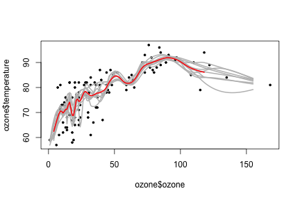


---

## Bagging en caret

- Algunos modelos que hacen bagging, en `train` considere las funciones en la opción `method`  
    - `bagEarth` 
    - `treebag`
    - `bagFDA`
- Alternativamente, puedes cargar cualquier modelo que elijas usando la función  `bag`

---

## Más bagging en caret


```r
suppressMessages(suppressWarnings(library(caret)))
predictors = data.frame(ozone=ozone$ozone)
temperature = ozone$temperature
treebag <- bag(predictors, temperature, B = 10,
                bagControl = bagControl(fit = ctreeBag$fit,
                                        predict = ctreeBag$pred,
                                        aggregate = ctreeBag$aggregate))
```

```
## Warning: executing %dopar% sequentially: no parallel backend registered
```

http://www.inside-r.org/packages/cran/caret/docs/nbBag


---

## Eejemplo de bagging (continuación)


```r
plot(ozone$ozone,temperature,col = 'lightgrey',pch=19)
points(ozone$ozone,predict(treebag$fits[[1]]$fit,predictors), pch = 19, col = "red")
points(ozone$ozone,predict(treebag,predictors),pch=19,col="blue")
```

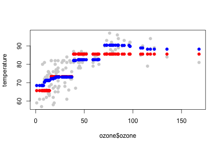


---

## Partes del bagging


```r
ctreeBag$fit
```

```
## function (x, y, ...) 
## {
##     loadNamespace("party")
##     data <- as.data.frame(x)
##     data$y <- y
##     party::ctree(y ~ ., data = data)
## }
## <environment: namespace:caret>
```

---

## Partes del bagging


```r
ctreeBag$pred
```

```
## function (object, x) 
## {
##     if (!is.data.frame(x)) 
##         x <- as.data.frame(x)
##     obsLevels <- levels(object@data@get("response")[, 1])
##     if (!is.null(obsLevels)) {
##         rawProbs <- party::treeresponse(object, x)
##         probMatrix <- matrix(unlist(rawProbs), ncol = length(obsLevels), 
##             byrow = TRUE)
##         out <- data.frame(probMatrix)
##         colnames(out) <- obsLevels
##         rownames(out) <- NULL
##     }
##     else out <- unlist(party::treeresponse(object, x))
##     out
## }
## <environment: namespace:caret>
```


---

## Partes del bagging


```r
ctreeBag$aggregate
```

```
## function (x, type = "class") 
## {
##     if (is.matrix(x[[1]]) | is.data.frame(x[[1]])) {
##         pooled <- x[[1]] & NA
##         classes <- colnames(pooled)
##         for (i in 1:ncol(pooled)) {
##             tmp <- lapply(x, function(y, col) y[, col], col = i)
##             tmp <- do.call("rbind", tmp)
##             pooled[, i] <- apply(tmp, 2, median)
##         }
##         if (type == "class") {
##             out <- factor(classes[apply(pooled, 1, which.max)], 
##                 levels = classes)
##         }
##         else out <- as.data.frame(pooled)
##     }
##     else {
##         x <- matrix(unlist(x), ncol = length(x))
##         out <- apply(x, 1, median)
##     }
##     out
## }
## <environment: namespace:caret>
```


---

## _Random forests_ - Bosques aleatorios  

1. Muestras Bootstrap 
2. En cada división, las variables bootstrap 
3. Construir árboles múltiples y escoger
__Pros__:

1. Precisión

__Cons__:

1. Velocidad
2. Interpretabilidad
3. Sobreajuste


---

## _Random forests_ - Bosques aleatorios  

<center>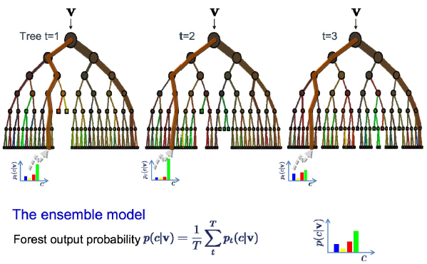</center>

---

## Datos Iris 


```r
data(iris); 
suppressMessages(suppressWarnings(library(ggplot2)))
inTrain <- createDataPartition(y=iris$Species,
                              p=0.7, list=FALSE)
training <- iris[inTrain,]
testing <- iris[-inTrain,]
```


---

## Random forests


```r
suppressMessages(suppressWarnings(library(caret)))
modFit <- train(Species~ .,data = training, method = "rf",prox=TRUE)
```

```
## Loading required package: randomForest
```

```
## randomForest 4.6-12
```

```
## Type rfNews() to see new features/changes/bug fixes.
```

```
## 
## Attaching package: 'randomForest'
```

```
## The following object is masked from 'package:Hmisc':
## 
##     combine
```

```
## The following object is masked from 'package:ggplot2':
## 
##     margin
```

```r
modFit
```

```
## Random Forest 
## 
## 105 samples
##   4 predictor
##   3 classes: 'setosa', 'versicolor', 'virginica' 
## 
## No pre-processing
## Resampling: Bootstrapped (25 reps) 
## Summary of sample sizes: 105, 105, 105, 105, 105, 105, ... 
## Resampling results across tuning parameters:
## 
##   mtry  Accuracy   Kappa    
##   2     0.9314502  0.8959701
##   3     0.9335846  0.8992387
##   4     0.9285176  0.8916327
## 
## Accuracy was used to select the optimal model using  the largest value.
## The final value used for the model was mtry = 3.
```

---

## Obteniendo un árbol 


```r
getTree(modFit$finalModel,k=2)
```

```
##   left daughter right daughter split var split point status prediction
## 1             2              3         4        0.75      1          0
## 2             0              0         0        0.00     -1          1
## 3             4              5         3        5.15      1          0
## 4             6              7         4        1.75      1          0
## 5             0              0         0        0.00     -1          3
## 6             0              0         0        0.00     -1          2
## 7             8              9         2        3.10      1          0
## 8             0              0         0        0.00     -1          3
## 9             0              0         0        0.00     -1          2
```

---

## Clase "centers"


```r
irisP <- classCenter(training[,c(3,4)], training$Species, modFit$finalModel$prox)
irisP <- as.data.frame(irisP); irisP$Species <- rownames(irisP)
p <- qplot(Petal.Width, Petal.Length, col=Species,data=training)
p + geom_point(aes(x=Petal.Width,y=Petal.Length,col=Species),size=5,shape=4,data=irisP)
```

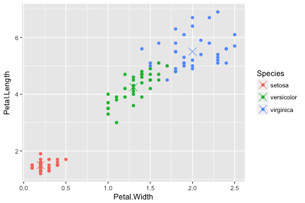

---

## Predicciones


```r
pred <- predict(modFit,testing); testing$predRight <- pred==testing$Species
table(pred,testing$Species)
```

```
##             
## pred         setosa versicolor virginica
##   setosa         15          0         0
##   versicolor      0         15         0
##   virginica       0          0        15
```

---

## Predicciones


```r
qplot(Petal.Width,Petal.Length,colour=predRight,data=testing,main="newdata Predictions")
```

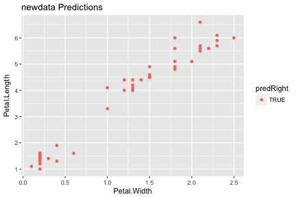

---


## Boosting 

1. Tomar muchos predictores (posiblemente) débiles
2. Añada peso y agrégalas
3. Consiga un predictor más fuerte


---

## Idea detras de Boosting 

1. Comience con un conjunto de clasificadores $h_1,\ldots,h_k$
    - Ejemplos: Todos los posibles _trees_, Todos los posibles modelos de regresión, Todos los posibles puntos de cortes .
2. Cree un clasificador que combine funciones de clasificación: $f(x) = \rm{sgn}\left(\sum_{t=1}^T \alpha_t h_t(x)\right)$.


    - La meta es minimizar el error (training)
    - Iterativo, seleccione un $h$ en cada paso
    - Calcular pesos basados en errores
    - Recalcular el peso de clasificaciones y selecciona la siguiente $h$


---


## Ejemplo 

<center>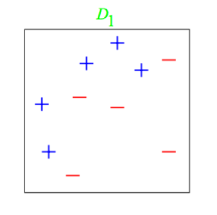</center>

---

## Iteración 1: adaboost

<center>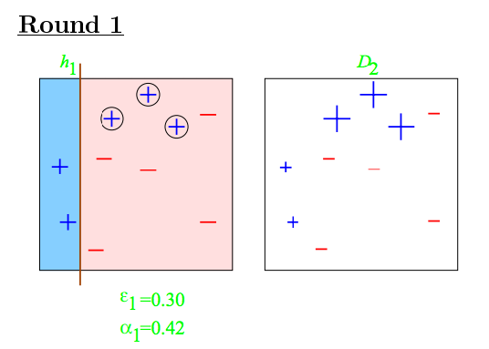</center>

---

## Iteración 2 & 3

<center>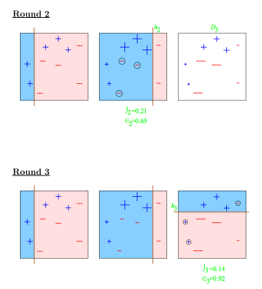</center>

---

## Clasificador completo

<center>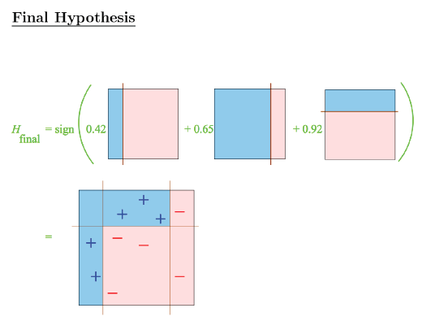</center>

---

## Ejemplo Wage


```r
suppressMessages(suppressWarnings(library(ISLR)))
suppressMessages(suppressWarnings(library(ggplot2)))
suppressMessages(suppressWarnings(library(caret)))
data(Wage)
Wage <- subset(Wage,select = -c(logwage))
inTrain <- createDataPartition(y = Wage$wage,
                              p = 0.7, list = FALSE)
training <- Wage[inTrain,]; testing <- Wage[-inTrain,]
```


---

## Ajuste del modelo


```r
suppressMessages(suppressWarnings( modFit <- train(wage ~ ., method = "gbm", data = training,
                verbose = FALSE)))
print(modFit)
```

```
## Stochastic Gradient Boosting 
## 
## 2102 samples
##   10 predictor
## 
## No pre-processing
## Resampling: Bootstrapped (25 reps) 
## Summary of sample sizes: 2102, 2102, 2102, 2102, 2102, 2102, ... 
## Resampling results across tuning parameters:
## 
##   interaction.depth  n.trees  RMSE      Rsquared 
##   1                   50      33.75478  0.3084619
##   1                  100      33.20415  0.3175358
##   1                  150      33.12932  0.3190985
##   2                   50      33.19342  0.3197553
##   2                  100      33.02979  0.3230936
##   2                  150      33.09875  0.3209580
##   3                   50      33.07416  0.3223431
##   3                  100      33.12587  0.3197613
##   3                  150      33.24252  0.3163562
## 
## Tuning parameter 'shrinkage' was held constant at a value of 0.1
## 
## Tuning parameter 'n.minobsinnode' was held constant at a value of 10
## RMSE was used to select the optimal model using  the smallest value.
## The final values used for the model were n.trees = 100,
##  interaction.depth = 2, shrinkage = 0.1 and n.minobsinnode = 10.
```

---

## Gráfico resultado


```r
qplot(predict(modFit,testing),wage, data = testing)
```

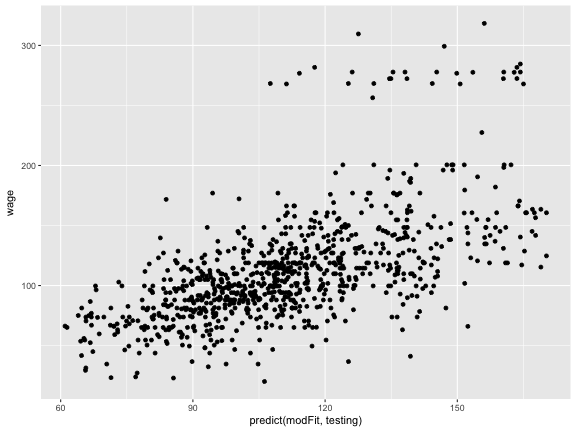

---


## Modelos basados en predicción 

1. Supongamos que los datos siguen un modelo probabilístico
2. Utilice el teorema de Bayes para identificar clasificadores óptimos

__Pros:__

- Toma ventaja de la estructura de los datos 
- Puede ser conveniente en términos de computo 
- Son razonablemente precisos en problemas reales 

__Cons:__

- Realiza supuestos adicionales acerca de los datos 
- Cuando el modelo es incorrecto se ve afectada la precisión

---

## Enfoque 


1. El objetivo es construir modelos parámetricos para distribuciones condicionales $P(Y = k | X = x)$

2. Un enfoque tradicional es [Bayes theorem](http://en.wikipedia.org/wiki/Bayes'_theorem):
$$ Pr(Y = k | X=x) = \frac{Pr(X=x|Y=k)Pr(Y=k)}{\sum_{\ell=1}^K Pr(X=x |Y = \ell) Pr(Y=\ell)}$$
$$Pr(Y = k | X=x) = \frac{f_k(x) \pi_k}{\sum_{\ell = 1}^K f_{\ell}(x) \pi_{\ell}}$$

3. Probabilidades típicamente _a priori_ $\pi_k$ son fijadas de antemano.

4. Una opción común para $f_k(x) = \frac{1}{\sigma_k \sqrt{2 \pi}}e^{-\frac{(x-\mu_k)^2}{\sigma_k^2}}$, una distribución normal

5. Estimar los parámetros ($\mu_k$,$\sigma_k^2$) de los datos.

6. Clasifique a la clase con el valor más alto de $P(Y = k | X = x)$

---

## Clasificación

Una serie de modelos utilizan este enfoque

- Análisis discriminante lineal asume $f_k(x)$ una normal multivariada
- Análisis discriminante lineal asume $f_k(x)$ una normal multivariada, con diferentes covarianzas 
- [Predicción basada en modelos](http://www.stat.washington.edu/mclust/) 
Asume versiones más complicadas para la matriz de covarianza
- Naive Bayes asume la independencia entre las características de la construcción de modelos

http://statweb.stanford.edu/~tibs/ElemStatLearn/


--- 

## Por que Análisis discriminante lineal ?

$$log \frac{Pr(Y = k | X=x)}{Pr(Y = j | X=x)}$$

$$ = log \frac{f_k(x)}{f_j(x)} + log \frac{\pi_k}{\pi_j}$$

$$ = log \frac{\pi_k}{\pi_j} - \frac{1}{2}(\mu_k^T \Sigma^{-1}\mu_k - \mu_j^T \Sigma^{-1}\mu_j)$$

$$ + x^T \Sigma^{-1} (\mu_k - \mu_j)$$

http://statweb.stanford.edu/~tibs/ElemStatLearn/


---

## Límites de decisión

<center>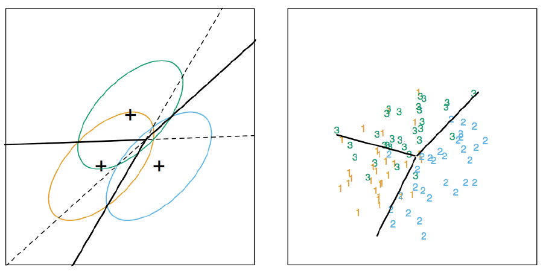</center>

---

## Función Discriminante 

$$\delta_k(x) = x^T \Sigma^{-1} \mu_k - \frac{1}{2}\mu_k \Sigma^{-1}\mu_k + log(\mu_k)$$


- Decidir sobre la clase basada en $\hat{Y}(x) = argmax_k \delta_k(x)$
- Usualmente los parámetros se estiman vía máxima verosimilitud

---

## Naive Bayes

Supongamos que tenemos muchos predictores, queremos modelar: $P(Y = k | X_1,\ldots,X_m)$

Podemos utilizar el teorema de bayes:

$$P(Y = k | X_1,\ldots,X_m) = \frac{\pi_k P(X_1,\ldots,X_m| Y=k)}{\sum_{\ell = 1}^K P(X_1,\ldots,X_m | Y=k) \pi_{\ell}}$$
$$ \propto \pi_k P(X_1,\ldots,X_m| Y=k)$$

Esto puede ser escrito:

$$P(X_1,\ldots,X_m, Y=k) = \pi_k P(X_1 | Y = k)P(X_2,\ldots,X_m | X_1,Y=k)$$
$$ = \pi_k P(X_1 | Y = k) P(X_2 | X_1, Y=k) P(X_3,\ldots,X_m | X_1,X_2, Y=k)$$
$$ = \pi_k P(X_1 | Y = k) P(X_2 | X_1, Y=k)\ldots P(X_m|X_1\ldots,X_{m-1},Y=k)$$

Podríamos hacer una suposición para escribir esto:

$$ \approx \pi_k P(X_1 | Y = k) P(X_2 | Y = k)\ldots P(X_m |,Y=k)$$

---

## Creando conjuntos training y test 


```r
data(iris)
inTrain <- createDataPartition(y = iris$Species,
                              p = 0.7, list = FALSE)
training <- iris[inTrain,]
testing <- iris[-inTrain,]
```

---

## Predicciones 


```r
modlda = train(Species ~ .,data = training, method = "lda")
modnb = train(Species ~ ., data = training,method = "nb")
```

```
## Loading required package: klaR
```

```r
plda = predict(modlda,testing); pnb = predict(modnb,testing)
table(plda,pnb)
```

```
##             pnb
## plda         setosa versicolor virginica
##   setosa         15          0         0
##   versicolor      0         14         0
##   virginica       0          2        14
```


---

## Comparación de resultados


```r
equalPredictions = (plda == pnb)
qplot(Petal.Width, Sepal.Width, colour = equalPredictions,
      data = testing)
```

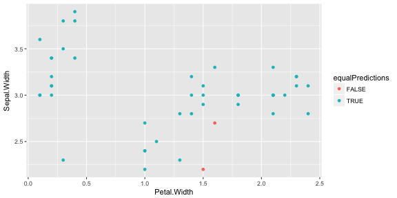

---


## Predicción no supervisada 

- Algunas veces como analista no sabes cual es tu variable respuesta (etiquetas)

- Construir un predictor 

    - Crear cluster 
    - Nombrar los cluster 
    - Construir predictores para los cluster 
    
- En un nuevo conjunto de datos 

    - Predecir los cluster 

--- 


## Ejemplo Iris ignorando las `Species` 


```r
suppressMessages(suppressWarnings(library(ggplot2)))
suppressMessages(suppressWarnings(library(caret)))
data(iris)
inTrain <- createDataPartition(y = iris$Species,
                               p = 0.7, list = FALSE)
training <- iris[inTrain,]
testing <- iris[-inTrain,]
dim(training); dim(testing)
```

```
## [1] 105   5
```

```
## [1] 45  5
```

---

## Cluster con `k-means`


```r
kMeans1 <- kmeans(subset(training,select = -c(Species)), centers = 3)
training$clusters <- as.factor(kMeans1$cluster)
qplot(Petal.Width, Petal.Length, colour = clusters, data = training)
```

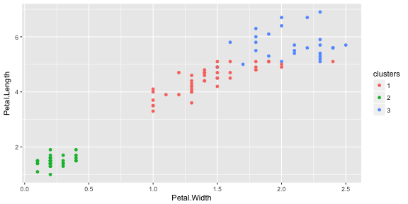


---

## Comparando con valores reales 


```r
table(kMeans1$cluster,training$Species)
```

```
##    
##     setosa versicolor virginica
##   1      0          2        25
##   2      0         33        10
##   3     35          0         0
```


---

## Construcción del predictor


```r
modFit <- train(clusters~.,
                data = subset(training,
                            select = -c(Species)), method = "rpart")
table(predict(modFit,training),training$Species)
```

```
##    
##     setosa versicolor virginica
##   1      0          0        23
##   2      0         35        12
##   3     35          0         0
```

---

## Aplicando en el `test`


```r
testClusterPred <- predict(modFit, testing) 
table(testClusterPred, testing$Species)
```

```
##                
## testClusterPred setosa versicolor virginica
##               1      0          0        11
##               2      0         15         4
##               3     15          0         0
```


---

## Combinando predictores 

- Puedes combinar clasificadores promediando/escogiendo
- La combinación de clasificadores mejora la precisión
- La combinación de clasificadores reduce la interpretabilidad
- `Boosting`, `bagging`, y `random forests` son variantes de este tema

---

## `Netflix prize`

BellKor = Combinación de 107 predictores  

<center></center>

[http://www.netflixprize.com//leaderboard](http://www.netflixprize.com//leaderboard)

---

## Conceptos básicos 

Suponga que tenemos 5 clasificadores completamente independientes 

Si la precisión es del 70% para cada uno:
    
    - $10\times(0.7)^3(0.3)^2 + 5\times(0.7)^4(0.3)^2 + (0.7)^5$
    - 83.7% precisión de la escogencia mayoritaria 

Con 101 

    - 99.9% precisión de la escogencia mayoritaria 

---


## Enfoques para combinar predictores 

1. `Bagging`, `boosting`, `random forests`

    - Normalmente combinan clasificadores similares

2. Combinación de diferentes clasificadores

    - `Model stacking`
    - `Model ensembling`

---

## Ejemplo con  `Wage` 


```r
suppressMessages(suppressWarnings(library(ISLR)))
suppressMessages(suppressWarnings(library(ggplot2)))
suppressMessages(suppressWarnings(library(caret)))
data(Wage) 
Wage <- subset(Wage, select = -c(logwage))

inBuild <- createDataPartition(y = Wage$wage,
                               p = 0.7, list = FALSE)
validation <- Wage[-inBuild,]; buildData <- Wage[inBuild,]

inTrain <- createDataPartition(y = buildData$wage,
                               p = 0.7, list = FALSE)
training <- buildData[inTrain,]; testing <- buildData[-inTrain,]
```

---


## Contruyendo dos modelos 


```r
mod1 <- suppressMessages(suppressWarnings(
    train(wage ~., method = "glm", data = training)
    ))

mod2 <- suppressMessages( suppressWarnings( train(wage ~., method = "rf",
              data = training, 
              trControl = trainControl(method = "cv"), number = 3)
              ))
```

---

## Predicciones 


```r
pred1 <- predict(mod1,testing); pred2 <- predict(mod2,testing)
```

```
## Warning in predict.lm(object, newdata, se.fit, scale = 1, type =
## ifelse(type == : prediction from a rank-deficient fit may be misleading
```

```r
qplot(pred1, pred2, colour = wage, data = testing)
```

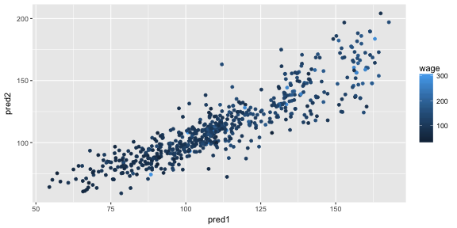


---

## Ajustando un modelo que combina predictores 


```r
predDF <- data.frame(pred1, pred2, wage = testing$wage)
combModFit <- train(wage ~., method = "gam", data = predDF)
```

```
## Loading required package: mgcv
```

```
## Loading required package: nlme
```

```
## 
## Attaching package: 'nlme'
```

```
## The following object is masked from 'package:HistData':
## 
##     Wheat
```

```
## This is mgcv 1.8-17. For overview type 'help("mgcv-package")'.
```

```r
combPred <- predict(combModFit,predDF)
```


---

## Calculando los errores 


```r
sqrt(sum((pred1 - testing$wage)^2))
```

```
## [1] 900.0146
```

```r
sqrt(sum((pred2 - testing$wage)^2))
```

```
## [1] 936.7921
```

```r
sqrt(sum((combPred - testing$wage)^2))
```

```
## [1] 885.7341
```


---

## Predicciones en el conjunto de validación 


```r
pred1V <- predict(mod1,validation); pred2V <- predict(mod2,validation)
```

```
## Warning in predict.lm(object, newdata, se.fit, scale = 1, type =
## ifelse(type == : prediction from a rank-deficient fit may be misleading
```

```r
predVDF <- data.frame(pred1 = pred1V, pred2 = pred2V)
combPredV <- predict(combModFit,predVDF)
```


---


## Evaluar en la validación


```r
sqrt(sum((pred1V - validation$wage)^2))
```

```
## [1] 992.2389
```

```r
sqrt(sum((pred2V - validation$wage)^2))
```

```
## [1] 1001.23
```

```r
sqrt(sum((combPredV - validation$wage)^2))
```

```
## [1] 992.7207
```


---

## Matriz de datos 


```r
set.seed(12345); par(mar = rep(0.2,4))
dataMatrix <- matrix(rnorm(400),nrow = 40)
image(1:10,1:40,t(dataMatrix)[,nrow(dataMatrix):1])
```

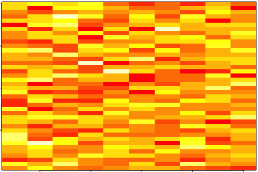

---

## Cluster de los datos 


```r
par(mar = rep(0.2,4))
heatmap(dataMatrix)
```

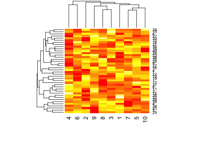

---

## ¿Qué pasa si agregamos un patrón?


```r
set.seed(678910)
for (i in 1:40) {
  # flip a coin
  coinFlip <- rbinom(1,size = 1,prob = 0.5)
  # if coin is heads add a common pattern to that row
  if (coinFlip) {
    dataMatrix[i,] <- dataMatrix[i,] + rep(c(0,3),each = 5)
  }
}
```


---

## ¿Qué pasa si agregamos un patrón? - Los datos 


```r
par(mar = rep(0.2,4))
image(1:10,1:40,t(dataMatrix)[,nrow(dataMatrix):1])
```

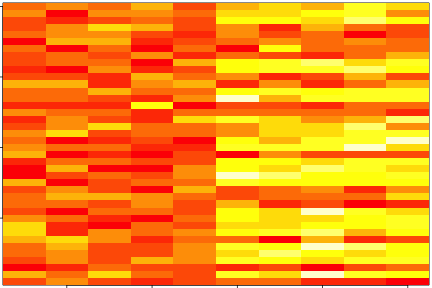


---

## ¿Qué pasa si agregamos un patrón? - El cluster


```r
par(mar = rep(0.2,4))
heatmap(dataMatrix)
```

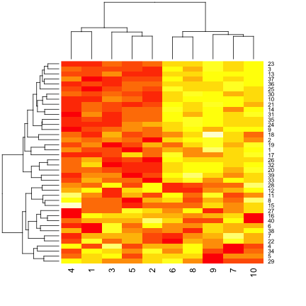


---

## Patrones en filas y columnas 


```r
hh <- hclust(dist(dataMatrix)); dataMatrixOrdered <- dataMatrix[hh$order,]
par(mfrow = c(1,3))
image(t(dataMatrixOrdered)[,nrow(dataMatrixOrdered):1])
plot(rowMeans(dataMatrixOrdered),40:1,xlab = "Row Mean",
     ylab = "Row",pch = 19)
plot(colMeans(dataMatrixOrdered),xlab = "Column",
     ylab = "Column Mean",pch = 19)
```

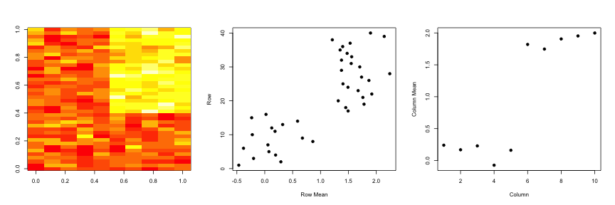

---

## Problemas relacionados 

Cuando se tienen múltiples variables  $X_1,\ldots,X_n$, así $X_1 = (X_{11},\ldots,X_{1m})$

- Encuentre un nuevo conjunto de variables multivariadas que no estén correlacionadas y explique la mayor varianza posible.

- Si se unen todas las variables en una matriz, encuentra la mejor matriz creada con menos variables (rango inferior) que explica los datos originales.

La meta principal es <font color="#330066"> estadística</font> la segunda meta es <font color="#993300">compresión de los datos </font>.

---

## Soluciones relacionadas - PCA/SVD

__SVD__

Si $X$ es una matriz con cada variable en una columna y cada observación en una fila, entonces la SVD es una "descomposición de la matriz"
$$ X = UDV^T$$

Donde la columnas de $U$ son ortogonales, las columnas de $V$ son ortogonales  y $D$ es la matriz diagonal (valores singulares). 

__PCA__

Los componentes principales son iguales a los valores singulares si se escala las variables primero.

---

## Componentes de la SVD - $u$ y $v$


```r
svd1 <- svd(scale(dataMatrixOrdered))
par(mfrow = c(1,3))
image(t(dataMatrixOrdered)[,nrow(dataMatrixOrdered):1])
plot(svd1$u[,1],40:1,xlab = "Row",
     ylab = "First left singular vector", pch = 19)
plot(svd1$v[,1],xlab = "Column",
     ylab = "First right singular vector", pch = 19)
```

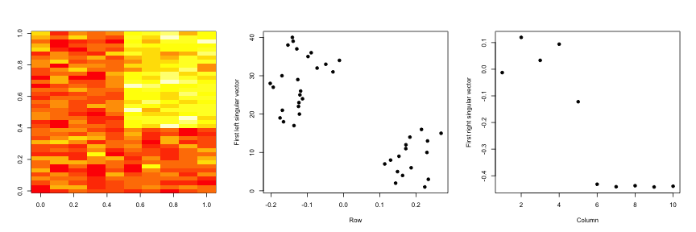


---

## Componentes de la SVD - Varianza explicada


```r
par(mfrow = c(1,2))
plot(svd1$d, xlab = "Column", ylab = "Singular value", pch = 19)
plot(svd1$d^2/sum(svd1$d^2), xlab = "Column", ylab = "Prop. of variance explained", pch = 19)
```

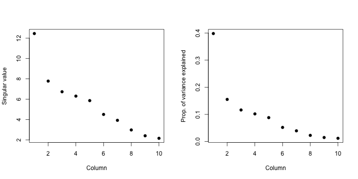


---

## Relación con los componentes principales


```r
svd1 <- svd(scale(dataMatrixOrdered))
pca1 <- prcomp(dataMatrixOrdered, scale = TRUE)
plot(pca1$rotation[,1],svd1$v[,1], pch = 19, xlab = "Principal Component 1", ylab = "Right Singular Vector 1")
abline(c(0,1))
```

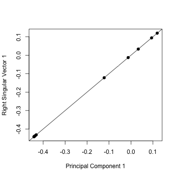

---

## Componentes de la  SVD - Varianza explicada


```r
constantMatrix <- dataMatrixOrdered*0
for (i in 1:dim(dataMatrixOrdered)[1]) { 
    constantMatrix[i,] <- rep(c(0,1),each = 5)}
svd1 <- svd(constantMatrix)
par(mfrow = c(1,3))
image(t(constantMatrix)[,nrow(constantMatrix):1])
plot(svd1$d, xlab = "Column", ylab = "Singular value", pch = 19)
plot(svd1$d^2/sum(svd1$d^2), xlab = "Column", ylab = "Prop. of variance explained", pch = 19)
```

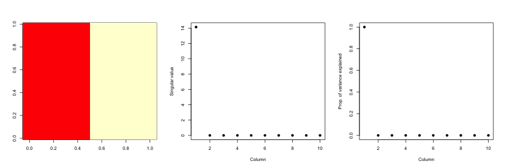


---

## ¿Qué pasa si agregamos un patrón?


```r
set.seed(678910)
for(i in 1:40){
  # flip a coin
  coinFlip1 <- rbinom(1, size = 1, prob = 0.5)
  coinFlip2 <- rbinom(1, size = 1, prob = 0.5)
  # if coin is heads add a common pattern to that row
  if(coinFlip1){
    dataMatrix[i,] <- dataMatrix[i,] + rep(c(0,5),each = 5)
  }
  if(coinFlip2){
    dataMatrix[i,] <- dataMatrix[i,] + rep(c(0,5),5)
  }
}
hh <- hclust(dist(dataMatrix)); dataMatrixOrdered <- dataMatrix[hh$order,]
```

---

## Descomposición en valores singulares - patrones verdaderos


```r
svd2 <- svd(scale(dataMatrixOrdered))
par(mfrow = c(1,3))
image(t(dataMatrixOrdered)[,nrow(dataMatrixOrdered):1])
plot(rep(c(0,1), each = 5), pch = 19, xlab = "Column",ylab = "Pattern 1")
plot(rep(c(0,1),5), pch = 19, xlab = "Column", ylab = "Pattern 2")
```


---

##  $v$ y patrones de varianza en filas


```r
svd2 <- svd(scale(dataMatrixOrdered))
par(mfrow = c(1,3))
image(t(dataMatrixOrdered)[,nrow(dataMatrixOrdered):1])
plot(svd2$v[,1], pch = 19, xlab = "Column",ylab="First right singular vector")
plot(svd2$v[,2],pch=19,xlab="Column",ylab="Second right singular vector")
```

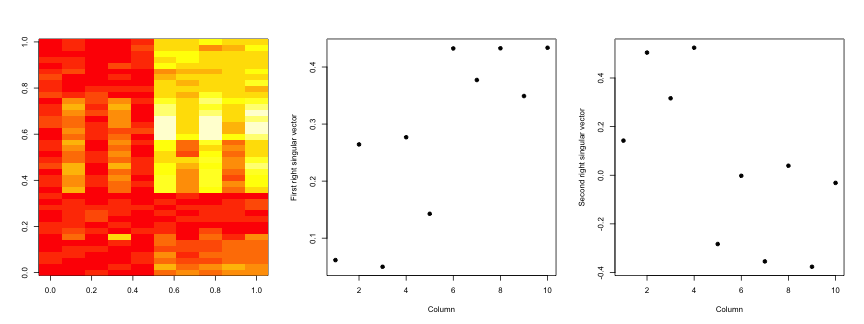


---

##  $d$ y la varianza explicada


```r
svd1 <- svd(scale(dataMatrixOrdered))
par(mfrow = c(1,2))
plot(svd1$d,xlab = "Column", ylab = "Singular value", pch = 19)
plot(svd1$d^2/sum(svd1$d^2), xlab = "Column", 
     ylab = "Percent of variance explained",pch = 19)
```

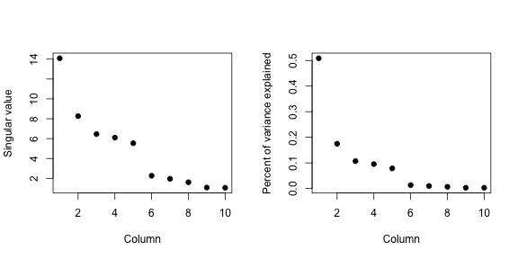

---

## valores faltantes 


```r
dataMatrix2 <- dataMatrixOrdered
## Randomly insert some missing data
dataMatrix2[sample(1:100,size = 40, replace = FALSE)] <- NA
svd1 <- svd(scale(dataMatrix2))  ## Doesn't work!
```

```
## Error in svd(scale(dataMatrix2)): infinite or missing values in 'x'
```


---

## Imputación {impute}


```r
library(impute)  ## Available from http://bioconductor.org
dataMatrix2 <- dataMatrixOrdered
dataMatrix2[sample(1:100,size=40,replace=FALSE)] <- NA
dataMatrix2 <- impute.knn(dataMatrix2)$data
svd1 <- svd(scale(dataMatrixOrdered)); svd2 <- svd(scale(dataMatrix2))
par(mfrow=c(1,2)); plot(svd1$v[,1],pch=19); plot(svd2$v[,1],pch=19)
```

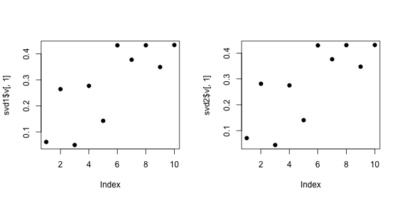


---

## Ejemplo 

<!-- ## source("http://dl.dropbox.com/u/7710864/courseraPublic/myplclust.R") -->


```r
load("data/face.rda")
image(t(faceData)[,nrow(faceData):1])
```


---

## Ejemplo - varianza explicada


```r
svd1 <- svd(scale(faceData))
plot(svd1$d^2/sum(svd1$d^2),pch=19,xlab="Singular vector",ylab="Variance explained")
```

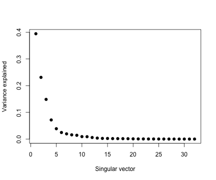

---

## Ejemplo - Crear aproximaciones


```r
svd1 <- svd(scale(faceData))
## Note that %*% is matrix multiplication

# Here svd1$d[1] is a constant
approx1 <- svd1$u[,1] %*% t(svd1$v[,1]) * svd1$d[1]

# In these examples we need to make the diagonal matrix out of d
approx5 <- svd1$u[,1:5] %*% diag(svd1$d[1:5])%*% t(svd1$v[,1:5]) 
approx10 <- svd1$u[,1:10] %*% diag(svd1$d[1:10])%*% t(svd1$v[,1:10]) 
```

---

## Ejemplo - gráfico 


```r
par(mfrow=c(1,4))
image(t(approx1)[,nrow(approx1):1], main = "(a)")
image(t(approx5)[,nrow(approx5):1], main = "(b)")
image(t(approx10)[,nrow(approx10):1], main = "(c)")
image(t(faceData)[,nrow(faceData):1], main = "(d)")  ## Original data
```

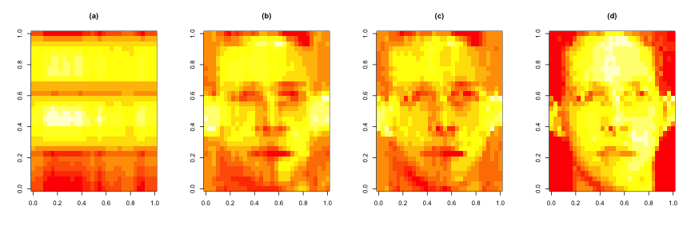


---

## ¿Podemos encontrar cosas cercanas?

- ¿Cómo definimos cercanía?
- ¿Cómo agrupar cosas?
- ¿Cómo visualizamos los grupos?
- ¿Cómo interpretamos los grupos?


---

## ¿Cómo definimos cercanía?

- Paso más importante 
    - Basura entra $\longrightarrow$ basura sale 
- Distancia o similitud
    - Continuas - distancia euclidiana
    - Continuas - correlación similitud 
    - Binaría - distancia de manhattan
- Escoja una distancia / o mediada de similaridad que tenga sentido para su problema
  

---

## K-means clustering

- Un enfoque de partición
    - Fija un número de clusters
    - Obtiene los "centroides" de cada cluster
    - Asignar los elementos al centroide más cercano
    - Recalcular los centroides
- Requiere
    - Una métrica de distancia definida
    - Un número de clusters
    - Una sugerencia para el inicio del centroide  
- Produce
    - Estimación final de los centroides del cluster
    - Una asignación de cada punto a los clusters
  

---

## K-means clustering -  Ejemplo


```r
set.seed(1234); par(mar=c(0,0,0,0))
x <- rnorm(12,mean=rep(1:3,each=4),sd=0.2)
y <- rnorm(12,mean=rep(c(1,2,1),each=4),sd=0.2)
plot(x,y,col="blue",pch=19,cex=2)
text(x+0.05,y+0.05,labels=as.character(1:12))
```

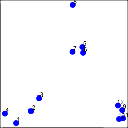


---

## K-means clustering -  Centroides de inicio


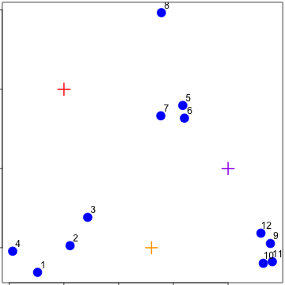

---

## K-means clustering -  Asignar al centróide más cercano

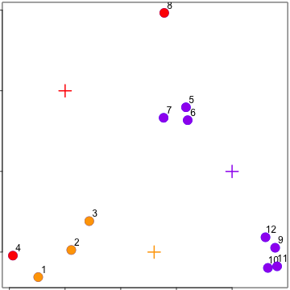

---

## K-means clustering -  Recalcular los centroides

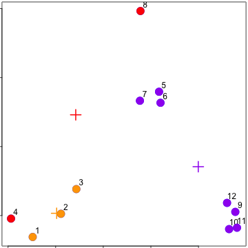


---

## K-means clustering -  Reasignar valores

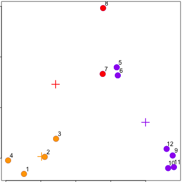


---

## K-means clustering -  Actualización centróides

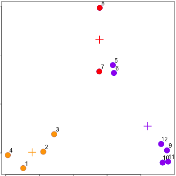


---

## `kmeans()`

- Parámetros importantes: _x_, _centers_, _iter.max_, _nstart_


```r
dataFrame <- data.frame(x,y)
kmeansObj <- kmeans(dataFrame, centers = 3)
names(kmeansObj)
```

```
## [1] "cluster"      "centers"      "totss"        "withinss"    
## [5] "tot.withinss" "betweenss"    "size"         "iter"        
## [9] "ifault"
```

```r
kmeansObj$cluster
```

```
##  [1] 3 3 3 3 1 1 1 1 2 2 2 2
```

---

## `kmeans()`


```r
par(mar=rep(0.2,4))
plot(x,y,col=kmeansObj$cluster,pch=19,cex=2)
points(kmeansObj$centers,col=1:3,pch=3,cex=3,lwd=3)
```

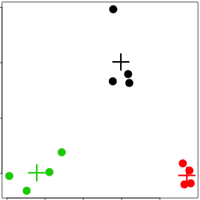

---

## Heatmaps


```r
set.seed(1234)
dataMatrix <- as.matrix(dataFrame)[sample(1:12),]
kmeansObj2 <- kmeans(dataMatrix,centers=3)
par(mfrow=c(1,2), mar = c(2, 4, 0.1, 0.1))
image(t(dataMatrix)[,nrow(dataMatrix):1],yaxt="n")
image(t(dataMatrix)[,order(kmeansObj$cluster)],yaxt="n")
```

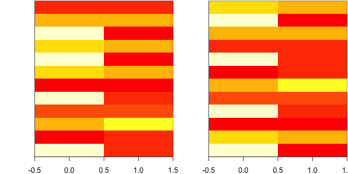


---

## Clustering Jerárquico

- Un enfoque aglomerativo
    - Encuentra las dos observaciones más cercanas
    - Póngalos juntos
    - Encontrar el siguiente más cercano
- Requiere
    - Una distancia definida
    - Un enfoque de fusión
- Produce
    - Un árbol que muestra lo cerca que están las observaciones entre sí


---


## ¿Cómo definimos cercanía?

- Paso más importante 
    - Basura entra $\longrightarrow$ basura sale 
- Distancia o similitud
    - Continuas - distancia euclidiana
    - Continuas - correlación similitud 
    - Binaría - distancia de manhattan
- Escoja una distancia / o mediada de similaridad que tenga sentido para su problema
  

---

## Ejemplo de distancias - Euclideana

<center>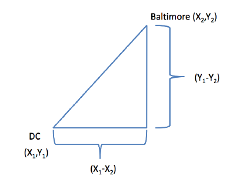</center>

[http://rafalab.jhsph.edu/688/lec/lecture5-clustering.pdf](http://rafalab.jhsph.edu/688/lec/lecture5-clustering.pdf)


---

## Ejemplo de distancias - Euclideana

<center>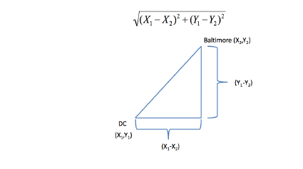</center>

En general:

$$\sqrt{(A_1-A_2)^2 + (B_1-B_2)^2 + \ldots + (Z_1-Z_2)^2}$$
[http://rafalab.jhsph.edu/688/lec/lecture5-clustering.pdf](http://rafalab.jhsph.edu/688/lec/lecture5-clustering.pdf)


---

## Ejemplo de distancias - Manhattan

<center>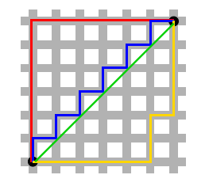</center>

En general:

$$|A_1-A_2| + |B_1-B_2| + \ldots + |Z_1-Z_2|$$

[http://en.wikipedia.org/wiki/Taxicab_geometry](http://en.wikipedia.org/wiki/Taxicab_geometry)


---

## Clustering Jerárquico - Ejemplo


```r
set.seed(1234); par(mar=c(0,0,0,0))
x <- rnorm(12,mean=rep(1:3,each=4),sd=0.2)
y <- rnorm(12,mean=rep(c(1,2,1),each=4),sd=0.2)
plot(x,y,col="blue",pch=19,cex=2)
text(x+0.05,y+0.05,labels=as.character(1:12))
```

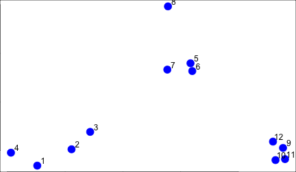


---

## Clustering Jerárquico - `dist`

- Parámetros Importantes: _x_,_method_

```r
dataFrame <- data.frame(x = x, y = y)
dist(dataFrame)
```

```
##             1          2          3          4          5          6
## 2  0.34120511                                                       
## 3  0.57493739 0.24102750                                            
## 4  0.26381786 0.52578819 0.71861759                                 
## 5  1.69424700 1.35818182 1.11952883 1.80666768                      
## 6  1.65812902 1.31960442 1.08338841 1.78081321 0.08150268           
## 7  1.49823399 1.16620981 0.92568723 1.60131659 0.21110433 0.21666557
## 8  1.99149025 1.69093111 1.45648906 2.02849490 0.61704200 0.69791931
## 9  2.13629539 1.83167669 1.67835968 2.35675598 1.18349654 1.11500116
## 10 2.06419586 1.76999236 1.63109790 2.29239480 1.23847877 1.16550201
## 11 2.14702468 1.85183204 1.71074417 2.37461984 1.28153948 1.21077373
## 12 2.05664233 1.74662555 1.58658782 2.27232243 1.07700974 1.00777231
##             7          8          9         10         11
## 2                                                        
## 3                                                        
## 4                                                        
## 5                                                        
## 6                                                        
## 7                                                        
## 8  0.65062566                                            
## 9  1.28582631 1.76460709                                 
## 10 1.32063059 1.83517785 0.14090406                      
## 11 1.37369662 1.86999431 0.11624471 0.08317570           
## 12 1.17740375 1.66223814 0.10848966 0.19128645 0.20802789
```

---

## Clustering Jerárquico - #1

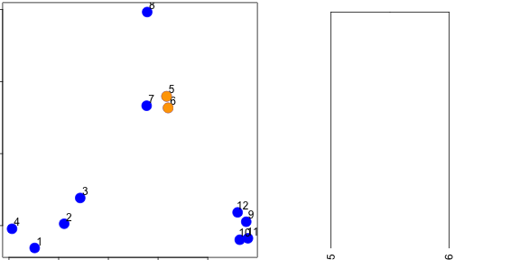


---

## Clustering Jerárquico - #2

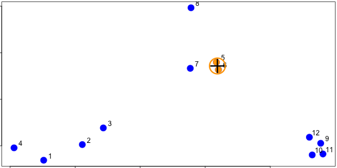


---

## Clustering Jerárquico - #3

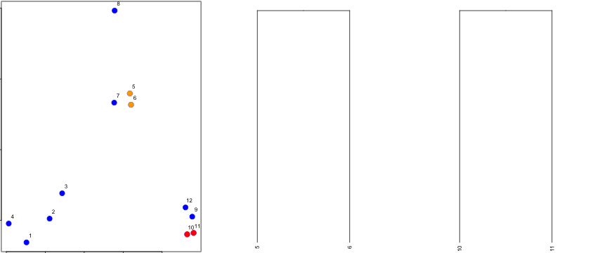


---

## Clustering Jerárquico - hclust


```r
dataFrame <- data.frame(x=x,y=y)
distxy <- dist(dataFrame)
hClustering <- hclust(distxy)
plot(hClustering)
```

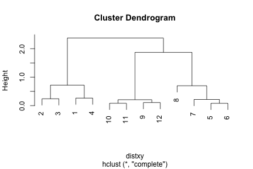


---

## Mejores dendrogramas


```r
myplclust <- function( hclust, lab=hclust$labels, lab.col=rep(1,length(hclust$labels)), hang=0.1,...){
  ## modifiction of plclust for plotting hclust objects *in colour*!
  ## Copyright Eva KF Chan 2009
  ## Arguments:
  ##    hclust:    hclust object
  ##    lab:        a character vector of labels of the leaves of the tree
  ##    lab.col:    colour for the labels; NA=default device foreground colour
  ##    hang:     as in hclust & plclust
  ## Side effect:
  ##    A display of hierarchical cluster with coloured leaf labels.
  y <- rep(hclust$height,2); x <- as.numeric(hclust$merge)
  y <- y[which(x<0)]; x <- x[which(x<0)]; x <- abs(x)
  y <- y[order(x)]; x <- x[order(x)]
  plot( hclust, labels=FALSE, hang=hang, ... )
  text( x=x, y=y[hclust$order]-(max(hclust$height)*hang),
        labels=lab[hclust$order], col=lab.col[hclust$order], 
        srt=90, adj=c(1,0.5), xpd=NA, ... )
}
```


---

## Mejores dendrogramas


```r
dataFrame <- data.frame(x=x,y=y)
distxy <- dist(dataFrame)
hClustering <- hclust(distxy)
myplclust(hClustering,lab=rep(1:3,each=4),lab.col=rep(1:3,each=4))
```

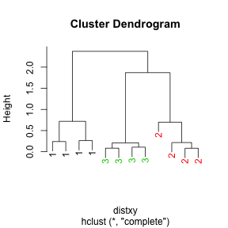

---

## Fusión de puntos - completa

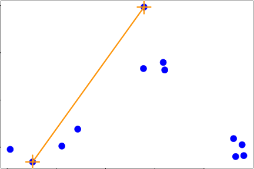


---

## Fusión de puntos - promedio

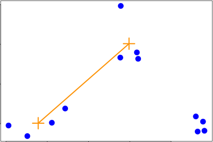


---

## `heatmap()`


```r
dataFrame <- data.frame(x=x,y=y)
set.seed(143)
dataMatrix <- as.matrix(dataFrame)[sample(1:12),]
heatmap(dataMatrix)
```

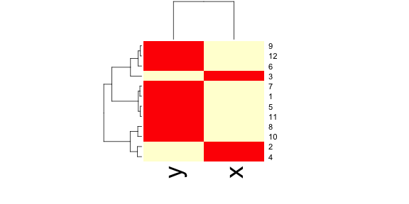


---


